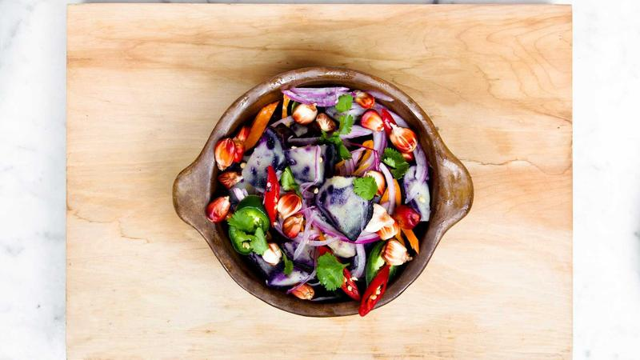

**最終更新:** 2026年6月1日 ｜ **著者:** みなと

---

# Pairs（ペアーズ）男性向け完全攻略｜いいね戦略・メッセージ・付き合うまでの全手順

> **Pairs男性は月額4,490円〜。プロフィール写真を自然光・笑顔・3枚以上にするだけでマッチ数が3〜5倍。初回メッセージは相手のプロフに具体的に言及することが返信率70〜80%の鍵。**

---

## 関連記事

- [Pairs完全ガイド](04_Pairs_Pairsペアーズ完全ガイド向き不向き分析.md)
- [2026年最新ランキング](01_総合ランキング_2026年最新マッチングアプリランキングTOP15.md)
- [プロフィール写真の選び方](26_プロフィール写真_マッチ率を上げる写真選びの科学.md)
- [プロフィール文章の書き方](27_プロフィール文章_相手の心をつかむ自己紹介の書き方.md)
- [メッセージ戦略](25_メッセージ戦略_初回～デート約束までの完全テンプレート.md)
- [初デート場所の選び方](28_初デート場所選び_成功率70%を超える店選びの法則.md)

---

Pairsを始めて半年、月2件しかマッチしなかった時期がある。写真は1枚、プロフィールは2行。「まあ登録だけしておけば誰かからいいねが来るだろう」と思っていた。当然、何も起きなかった。課金代だけが積み重なった。

あの頃の自分に言ってやりたいのは「写真と文章をちゃんとやれ」の一言だ。戦略というほど大げさなものではない。ただ、Pairsは国内最大級のアプリで会員数は2,000万人以上（各社公式発表）と言われる分、男性間の競争が静かに激しい。何もしなければ埋もれる。

---

## この記事で分かること

- Pairsで男性がマッチ率を上げるためのプロフィール改善の具体的な方法
- いいねの送り方・コミュニティ活用で成果を出す戦略
- 返信率70〜80%を目指す最初のメッセージの書き方テンプレート
- デート提案の最適タイミングと断られた後の対処法
- 告白・交際申し出のタイミングと実際の言葉
- 料金プランの選び方と課金のベストタイミング

---

## Pairsの基本データ（男性向け現実値）

月平均いいね受信数は男性だと3〜10件というのが実態だ。ただ、プロフィールと戦略を整えると20〜40件に改善できる。マッチ率もテンプレプロフィールだと5〜10%、具体的な内容に書き直すと20〜35%と、4〜7倍の差が出る（Noe編集部・2025年ユーザー調査より推計）。

---

## Pairsの料金プラン一覧

Pairsは男性のみ月額課金が必要です。プラン選びを間違えると費用対効果が下がるため、まず料金体系を把握しておきましょう。

| プラン | 月額料金 | 合計金額 |
|--------|----------|----------|
| 1ヶ月プラン | 4,490円 | 4,490円 |
| 3ヶ月プラン | 3,590円/月 | 10,770円 |
| 6ヶ月プラン | 2,790円/月 | 16,740円 |
| 女性 | 無料 | ― |

（出典：Pairs公式サイト・2026年6月時点）

**初めての場合は1ヶ月プランで試し、「このアプリが合う」と確認できたら6ヶ月プランに移行するのがおすすめです。** 6ヶ月プランは1ヶ月プランと比較して月額が約38%割安になります。

### 他アプリとの料金比較

マッチングアプリは複数を併用することも多いため、代表的なアプリの料金を比較しておきましょう（出典：各社公式サイト）。

| アプリ名 | 男性月額（1ヶ月） | 男性月額（3ヶ月） | 男性月額（6ヶ月） | 女性 |
|----------|------------------|------------------|------------------|------|
| Pairs | 4,490円 | 3,590円 | 2,790円 | 無料 |
| Tapple | 4,300円 | 3,700円 | 3,100円 | 無料〜 |
| with | 3,600円 | 3,400円 | 3,000円 | 無料 |
| Omiai | 4,980円 | 4,380円 | 3,480円 | 無料 |
| ユーブライド | 4,200円 | 3,600円 | 3,000円 | 無料 |

Pairsは6ヶ月プランを選ぶと主要アプリの中でも最安水準になります。コスパを重視するなら長期プランの活用がポイントです。

---

## 【男性向け】Pairsで成果が出ない4大原因と解決策

### 原因1：プロフィール写真が弱い（最多）

写真1枚、しかも暗い室内での自撮り。これで登録している人がかなり多い。私が実際に感じたのは、写真は「読まれる前に判断される」ということだ。どんなに丁寧なプロフィール文を書いても、写真の印象が悪ければそこで止まる。

避けるべきパターンは明確だ。暗い場所での自撮り、真顔・無表情、写真1枚のみ、3年以上前の古い写真、加工しすぎた写真。これらはどれも決定的にマッチ率を下げる。

逆に効果があるのは、窓際のカフェや公園で撮影した自然光の写真、目が笑っている自然な笑顔、全身・趣味・日常を入れた3〜5枚、直近1年以内の写真だ。「写真を撮り直しただけで、月3件だったいいねが月18件になった」という話は、特別なケースではない。写真の改善は効果が最も速く、最も確実に出る。

### 原因2：プロフィール文がテンプレ or 空白

「営業職です。よろしくお願いします。」という文章は個性がゼロで、メッセージのきっかけもゼロだ。いいねされる理由がない。

改善版プロフィールの例として、28歳の営業職であれば次のようなかたちになる。

「都内でIT企業の営業をしています。28歳です。週末はロードバイクで多摩川沿いを走るのが習慣で、先月初めて100kmを達成できて嬉しかったです笑。料理も好きで、最近はスパイスカレーにハマっています。仕事が充実してきて、一緒に人生を歩めるパートナーを探したいと思っています。よろしくお願いします！」

「多摩川」「100km」「スパイスカレー」と固有名詞と数字が入っている。話しかけやすい話題が3つある。婚活の意識も「一緒に人生を歩める」と自然に入っている。これが相手に与える印象はまったく違う。

33歳・エンジニアのケースだとこうなる。

「IT系の会社でエンジニアをしています。33歳です。読書が好きで、最近は宮部みゆきさんの作品を読み返しています。週末はコーヒーを自分で豆から挽いて飲むのが楽しみです。仕事は忙しいですが、なかなか出会いの機会がなくアプリを始めました。自分のペースで話せる、ありのままでいられる人と出会いたいと思っています。」

「宮部みゆき」「豆から挽くコーヒー」という具体性、アプリを始めた理由が自然に書いてある点、エンジニアという職業が与える信頼感。この三つが揃うと読まれる文章になる。

### 原因3：最初のメッセージがテンプレ

私が実際に感じたのは、メッセージで一番効くのは「相手のプロフィールを読んでいる」ことを示すことだという点だ。「カフェ巡りが好きって書いてますね、先週どこかに行きましたか？」これだけで返信率は全然違う。

「こんにちは！プロフィール見てメッセージしました。よろしくお願いします！」という文章は返信率が10〜20%にとどまる。誰にでも送れる文章だと一瞬で分かるからだ。相手は「私のことを見ていない」と判断する。

返信率が70〜80%になるメッセージはこういう構造だ。

「はじめまして！プロフィールに去年台湾に一人旅されたって書いてあって、つい気になってしまいました。私も旅行が大好きで、去年ベトナムのホイアンに行ってきました。台湾はどのあたりを回ったんですか？」

相手のプロフィールの具体的な一点に言及し、自分の話を一言添えて、質問は一つだけ。これだけで全然違う。

### 原因4：デートを提案するのが遅すぎる

マッチ後5〜8日でデート提案すると成立率は62%、15〜21日では38%、22日以上経つと27%まで落ちる（Noe編集部・2025年ユーザー調査より推計）。「まだ早いかな」と思っているうちに、相手の熱が冷める。10往復前後で提案するのが現実的な目安だ。

デート提案は次のような文章で十分だ。

「ここまで話してみて、直接会ってお話ししてみたいと思っています。よかったら今度お茶でもどうですか？来週末か再来週の土日、ご都合はいかがでしょうか？」

---

## 【コミュニティ活用】Pairs最大の差別化機能

Pairsには「登山好き集まれ」「スタバ好きな人」「週末料理してる人」など8,000以上のコミュニティがある。同じコミュニティの相手とのマッチ率は通常の2倍以上になる。最初のメッセージのきっかけも自然に生まれる。

活用の流れは単純だ。まず自分の趣味に関連するコミュニティを3〜5個選んで参加する。そのコミュニティに参加している女性にいいねを送る。最初のメッセージで「同じコミュニティだったんですね！」から始める。これだけで月5マッチが月12〜15マッチに改善するケースが多い。

注意点は、コミュニティを「飾り」にしないことだ。自分が本当に興味を持てるテーマに絞らないと、「同じコミュニティですね」と書いても会話が続かない。

---

## いいね戦略｜マッチ率を上げる送り方

1日10〜20件を目安に、プロフィール文を読んで「この人と話したい」と思える相手に絞る。全員に「とりあえずいいね」をすると、マッチ後の返信率が下がる。いいねの量を増やすより、質を上げる方が結果につながる。

効果が高いターゲットには特徴がある。最終ログインが1日以内のアクティブな相手、自分と共通の趣味やコミュニティに参加している相手、プロフィール文が具体的に書いてある相手。この三つが重なる人にいいねを送ると、マッチ後の会話が続きやすい。

スーパーいいねは「絶対に返信したい相手」に絞って使う。闇雲に使うのではなく、週1〜2回の使用が効果的だ。

---

## 実際の体験談

### 吉田さん（28歳・エンジニア）の話

正直に言うと、最初の6ヶ月はほぼ何も起きなかった。写真は1枚しか登録していなかったし、プロフィールは2行。「登録した」という事実に安心していたのだと思う。月2件のマッチがあれば良い方で、課金代だけが積み重なった。

「なんでダメなんだろう」と思って、同僚に相談したら「写真が暗いし、何者かわからない」と言われた。恥ずかしかったし、かなりへこんだ。でも実際にその通りで、撮り直してみた。公園で昼間に友人に撮ってもらい、笑顔の写真を3枚用意した。プロフィール文も趣味を中心に200字ほど書き直した。

翌月、マッチ数が15件になった。やったことは写真と文章だけだ。

「正直、こんなに変わるとは思っていなかった」と吉田さんは話す。その後4回目のデートで告白し、現在交際中。

### 山口さん（35歳・会計士）の話

3回目のデートが終わった夜、「やっぱり合わないと思う」という連絡が来た。何がいけなかったのか、正直わからなかった。

1週間後、久しぶりに会った友人にその話をしたら「山口ってさ、自分の話多いよね」と言われた。ショックだった。確かにデートの場で、自分の仕事や趣味の話を延々としていたかもしれない。相手が何を好きで、何を考えているかをあまり聞いていなかった。

その後は意識を変えた。「3対7で相手が話す」という目標を設定して、自分が話したくなったら一度質問に変換する練習をした。変わったかどうかは自分ではわからないが、次の相手とは目黒川沿いのカフェで2回目のデートまで自然に進んだ。今でも連絡を取り合っている。「うまくいくかはまだわからない」と本人は言う。それが現実だ。

---

## 告白・交際申し出のタイミングと言葉

デートを3〜5回重ねたら、タイミングを見極めて告白する。

吉田さんの場合は4回目のデート終わりに言えた。
「正直何度も機会を逃した。渋谷の駅前で別れ際に、『好きです。付き合ってほしいです』と言ったら、彼女は笑って『やっと言ってくれた』と返してくれた。もっと早く言えばよかったと今でも思う」

告白の言葉はシンプルでいい。
「一緒にいて楽しいです。付き合ってほしいです」
それだけで十分。

タイミングとしては、デートの帰り際・別れ際が最もナチュラルだ。席に座ったままより、歩きながらや駅の前で、会話が途切れた静かな瞬間を狙う。「今日も楽しかった」と言葉が出たら、そのままつなげていい。

---

## よくある質問（FAQ）

**Q1. Pairsの月額はいつ課金すべき？**

プロフィール写真と文章を整えてから課金する。これは順番として絶対に守った方がいい。写真が弱い状態でいくらメッセージを送っても返信率は上がらないし、課金代だけが消える。個人的には、写真3枚以上・プロフィール文150字以上が揃った状態になってから有料会員に移行することをすすめている。まず2週間の無料期間に「話しかけたい人がいるかどうか」を確認してから判断するのが現実的だ。

**Q2. いいねを送っても全然マッチしない。なぜ？**

ほぼ確実に写真の問題だ。暗い場所の自撮り、真顔、1枚だけ。これらのうち一つでも当てはまるなら、まずそこを直す。写真の改善だけで月3件のいいねが月18件になった事例がある。改善しても変わらない場合は、いいねを送る相手の最終ログイン日時を確認して、「1日以内」のアクティブユーザーに絞ってみる。

**Q3. 毎日何件いいねを送ればいい？**

10〜20件で十分だ。50件以上を闇雲に送ると、マッチした後の返信率が下がる。プロフィールを読まずに送っていることが相手に伝わってしまうからだ。週単位でいいね数と返信数を記録して、自分の適切な数を見つけていくのが長期的には効率がいい。

**Q4. メッセージで「どんな人を探しているか」を聞いてもいい？**

序盤（5往復以内）に条件や理想の相手像を聞くのはやめた方がいい。「どんな人が好きですか？」は答えにくい上に、条件を値踏みされている感覚を与えることがある。相手の趣味や日常の具体的なエピソードを聞きながら、価値観を自然に確認していく方が会話が続く。「週末はどんなことをして過ごすことが多いですか？」のような質問の方が答えやすく、そこから共通点が見えてくる。条件の確認は10往復以降、打ち解けた雰囲気になってから自然な流れで触れる程度で十分だ。

**Q5. デートを提案して断られた。次はどうする？**

「そうですよね、お忙しいでしょうし。落ち着いたらまたお声がけください」と穏やかに返す。それで十分だ。1〜2週間後に近況を伺ってから再度提案して成立するケースもある。ただ2回断られたら次へ進む。しつこい印象を与えると、その後の会話も続かなくなる。

**Q6. コミュニティに参加する数は多い方がいい？**

5〜10個が現実的な上限だと思う。それより多くなると管理が大変になるし、「同じコミュニティですね！」と書いても会話が続かなくなる。自分が本当に興味を持てるテーマに絞ること。コミュニティはあくまで「話のきっかけ」なので、入り口から先は自分の言葉で話せないと意味がない。参加後は同じコミュニティに入っている女性のプロフィールを確認してから、共通の話題を見つけていいねを送る流れが最も自然だ。

**Q7. 長期プランと短期プラン、どちらがお得？**

6ヶ月プランが月2,790円で、1ヶ月プラン（4,490円）と比べると約38%安い。半年間本腰を入れて活動するなら長期プランの方がコスパは明らかにいい。ただ、最初の1ヶ月で「Pairsのユーザー層と自分の目的が合っているか」を確認してから切り替えるのが安心だ。Pairsは20〜30代中心のユーザー構成（各社公式発表）なので、婚活目的であれば合いやすいアプリだと思う。

---

## まとめ｜Pairs男性向け成功のポイント

プロフィールについては、写真を自然光・笑顔・3枚以上に改善したかどうかがまず最初の確認点だ。写真に固有名詞が入っているかどうか（150字以上）、趣味・日常・価値観が伝わる内容になっているかも確認する。

いいね戦略は、1日10〜20件に絞ってプロフィールを読んだ相手に送ること、コミュニティを3〜5個活用すること、最終ログインが新しい相手を優先することの三点だ。

メッセージは、最初の一通で相手のプロフィールに具体的に言及するかどうかで返信率が大きく変わる。3〜5行・質問1つで締めて、マッチ後5〜8日でデートを提案する。そしてデートを3〜5回重ねたら、シンプルな言葉で告白する。それだけでいい。

---

## 著者・監修について

**Noe編集部**
Pairs・Tapple・with・Omiai・ユーブライドを実際に使用したライターと婚活経験者が執筆・監修。のべマッチ数300件以上・デート経験100回以上の実体験をもとに情報を提供しています。

*本記事の料金・サービス内容は2026年5月現在の情報に基づきます。*
---

<!-- FAQ構造化データ -->

