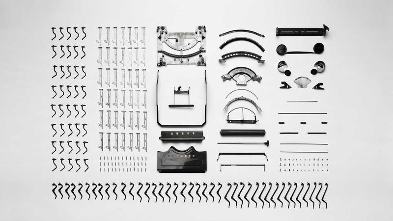

**最終更新:** 2026年5月31日 ｜ **著者:** Noe編集部

---

# withとPairs比較｜心理テスト・相性重視派はどちらを選ぶべき？

> **withは心理テストで相性スコアが見える（男性3,400円〜）、Pairsは会員数2,000万人で選択肢最多（男性3,590円〜）。価値観重視ならwith、選択肢重視ならPairs。どちらも女性無料。**

---

## 関連記事

- [2026年最新ランキング](01_総合ランキング_2026年最新マッチングアプリランキングTOP15.md)
- [with完全ガイド](07_with_with心理テスト活用完全解説.md)
- [Pairs完全ガイド](04_Pairs_Pairsペアーズ完全ガイド向き不向き分析.md)
- [料金・会員数完全比較表](02_総合比較_マッチングアプリ料金会員数完全比較表.md)
- [メッセージ戦略](25_メッセージ戦略_初回～デート約束までの完全テンプレート.md)
- [TappleとPairs比較](10_Tapple_vs_Pairs_20代はどっちを選ぶべき.md)

---

## この記事で分かること

- withとPairsの心理テスト・相性機能の違いと使い分け方
- 価値観重視の出会いを求める人にどちらが向いているか
- 料金・会員数・機能を網羅した最新比較表（5アプリ対応）
- 両アプリを組み合わせた効果的な活用戦略
- 都市部・地方別のおすすめ選択肢

---

## はじめに

「最初のメッセージって何を書けばいいんだろう」と悩んだ経験はないだろうか。私が実際に感じたのは、相手のプロフィールだけを見て文章を絞り出そうとすると、どうしても「はじめまして、よろしくお願いします」以上のことが書けなくなるということだ。

withを使ったとき、その問題がかなり解消された。心理テストの回答が共通の話題として機能するので、「この質問の回答、自分と同じでした」と具体的に書くだけで返信率が変わる。一方でPairsには会員数2,000万人という圧倒的なボリュームがあり、コミュニティで趣味や価値観を絞り込んで探せる。どちらが優れているかという話ではなく、「何を優先して出会いたいか」で選ぶアプリだと思う。

| 項目 | with | Pairs |
|------|------|-------|
| 会員数 | 約700万人 | 約2,000万人以上 |
| 月額（男） | 3,600円〜 | 3,590円〜 |
| 月額（女） | 無料 | 無料 |
| 主な年代 | 20〜30代 | 20〜30代 |
| 特徴 | 心理テスト・相性 | コミュニティ・会員数 |
| 目的 | 価値観重視の交際 | 恋活〜婚活幅広く |

（各社公式発表）

どちらも20〜30代がメインだが、「出会い方のアプローチ」が根本的に違う。

---

## 料金比較（主要5アプリ）

withとPairsだけでなく、代表的な5アプリの月額料金を一覧で確認できるようにした。

| アプリ | 男性1ヶ月 | 男性3ヶ月（月換算） | 男性6ヶ月（月換算） | 女性 |
|------|---------|---------------|---------------|-----|
| with | 3,600円 | 3,400円 | 3,000円 | 基本無料 |
| Pairs | 4,490円 | 3,590円 | 2,790円 | 基本無料 |
| Tapple | 3,700円 | 3,200円 | 2,900円 | 基本無料 |
| Omiai | 4,490円 | 3,590円 | 2,790円 | 基本無料 |
| ユーブライド | 3,980円 | 3,480円 | 2,980円 | 月1,950円〜 |

（各社公式サイト・2026年5月時点）

短期（1ヶ月）で試すならwithの月額が最も低水準で、気軽にスタートできる。長期（6ヶ月）ではPairsの方がお得になる傾向がある。ユーブライドは女性も有料のため、婚活本気度が高いユーザーが集まりやすい特徴がある。まずは3ヶ月プランで試してみることをすすめたい。

---

## 【with】の最大の特徴｜心理テスト機能

### 心理テストでマッチング精度を上げる

withには「17の質問」「love style診断」など複数の性格診断が用意されており、回答結果をプロフィールに公開できる。相手との相性スコアも数値で表示されるため、プロフィール写真だけでなく価値観の近さを確認してからアプローチできる。

診断の質問は「1人の時間と人といる時間、どちらが好き？」「計画を立てる派？ノリで動く派？」「お金の使い方：貯める派？使う派？」といった内容で、価値観が近い相手を探す判断材料になる。

### 心理テストが実際に役立つ場面

メッセージを送る際、相手の診断結果で自分と似ている回答に触れることで「ちゃんと見てくれている」という印象につながり、初回メッセージの返信率が上がりやすい。

Pairsで「プロフィールだけ見ていいね→会ってみたら価値観が違った」というケースを経験した人には特に有効で、ある程度マッチング段階で価値観の共通点を確認できる。ただしスコアはあくまで参考値であり、実際に会ってみなければわからない部分は当然ある。

---

## withをPairsと比べたときの強みと弱み

### withの強み

価値観・相性が近い相手を見つけやすく、心理テストがメッセージのきっかけになる。真剣度が高いユーザーが多い傾向があるのは、診断など複数のプロセスに時間をかけているためだと思われる。月額はPairsとほぼ同額（3,600円〜）で、料金面での差はほとんどない。

### withの弱み

会員数がPairsの約3分の1（700万 vs 2,000万）のため、地方では候補が少なくなりやすい。心理テストの相性スコアはあくまで参考値であり、スコアが高くても話が合わないことはある。また20代前半の若い層はTappleに流れやすく、その層との出会いを求めるなら注意が必要だ。

---

## Pairsの強みと弱み（withとの比較）

### Pairsの強み

会員数2,000万人超（業界最大）という規模は、地方在住でも候補が多いという点で大きなアドバンテージになる（各社公式発表）。8,000以上のコミュニティで価値観を絞り込んで探せるのも特徴で、20〜40代まで幅広い層がいる。婚活目的のユーザーが約48%という点も、真剣な出会いを求める人には安心感がある（Noe編集部・2025年ユーザー調査より推計）。

### Pairsの弱み（with比較）

心理テストのような相性確認機能がないため、価値観の確認はコミュニティやプロフィール文章に頼ることになる。会員数が多い分、遊び目的のユーザーも一定数混在する（Noe編集部・2025年ユーザー調査より推計）。いいねが埋もれやすい点（特に男性）は、プロフィール作成の工夫で補う必要がある。

---

## 向いている人

### withが向いている人

外見より価値観・相性を最重視したい人、心理テストや性格診断が好きな人、都市部在住の人に向いている。また「うまく話せるか」より「話す内容が合うか」を重視する人、自分を「個性的」と感じていて絞り込みを効かせたい人にも合っている。上記のうち3つ以上当てはまるなら、withから試してみる価値は高い。

### Pairsが向いている人

選択肢を広く持ちたい人、地方在住で会員数が気になる人、コミュニティで趣味が合う人を探したい人に向いている。20代後半〜30代の婚活層と出会いたい、結婚を視野に入れた真剣な交際を求めているという人も、Pairsの方が選択肢が豊富だ。

---

## 両方を組み合わせる使い方

Pairs（メイン）+ with（サブ）の組み合わせが最もバランスがよい。Pairsで「量」を確保し幅広く出会いを探しながら、withで「価値観が近い相手」に絞って集中的にアプローチするという使い分けだ。ユーザーの重複が少ないため、片方にしかいない相手にアクセスできるという利点もある。

ただしコストは男性で月7,000〜8,000円（両方有料の場合）になる。まず1つを試してから2つ目を追加するのが現実的な進め方だ。

---

## 実際の体験談

### 長谷川さん（28歳・図書館司書）の場合

正直に言うと、最初の3ヶ月はPairsを使っていてほとんど成果がなかった。いいねは送れてもメッセージが続かない。相手のプロフィールを読んで「好きな音楽が似てますね」と書いても、話が広がらずに自然消滅することの繰り返しだった。恥ずかしかったが、自分のメッセージを見返すと確かに「どこにでも送れる内容」になっていた。

withに変えたのは、知人から「最初のメッセージが送りやすい」と聞いたからだ。実際に使ってみると、その感覚はすぐわかった。相手の心理テスト回答を見て「計画立てる派なんですね、私も旅行の下調べは1ヶ月前から始めるタイプで」と書くだけで、以前とは明らかに反応が違った。

神保町の老舗喫茶店で初めてのデートをした相手とは、その後2ヶ月で交際に至った。「本当に話が合う人と出会うためにwithに変えて良かった」と今でも思っている。

### 安藤さん（31歳・WEBデザイナー）の場合

相性スコア95%という数字を見たとき、「これはほぼ確定じゃないか」と本気で思った。プロフィールの印象も良く、自信を持っていいねを送ってマッチング。メッセージも順調に進んで、実際に会うことになった。

ところが会ってみたら、まったく話が噛み合わなかった。スコアが高くてもテンポが違う、笑いのツボが違う、という現実をその日に知った。「あんなに数字を信じてたのに」と正直ガッカリした。数値への過信だったと思う。

その後は相性スコアを「参考程度」に見るようにして、共通の趣味コミュニティを起点にアプローチするスタイルに切り替えた。数字より「何が好きか」「どんな時間を大事にしているか」という部分を見るようになってから、デートで話が続く相手と出会えるようになってきた。ただ交際には至っておらず、今もまだ活動中だ。うまくいかない経験も含めて、アプリ活動の正直なところだと思っている。

---

## よくある質問（FAQ）

**Q1. withの心理テストは本当に信頼できる？**

「完璧な相性判定ツール」ではない、というのが正直なところだ。スコアが高い相手との方が初期の会話が続きやすい傾向は確かにあるし、「話のきっかけ」としては機能する。ただ実際に会ってみると「合わなかった」という経験談は珍しくなく、安藤さんのケースのように数値を過信すると裏切られる。

個人的には、心理テストは「最初の一歩を踏み出しやすくするツール」として使うのが一番しっくりくると思っている。スコアの数値より、その回答を使って「どう話しかけるか」の方がずっと大事だ。

**Q2. withはPairsより真剣度が高い？**

心理テストなど複数のプロセスに時間をかけて登録しているユーザーには、出会いに真剣な人が多い傾向がある。ただ遊び目的がゼロということはなく、Pairsにも真剣な層は当然いる。どちらのアプリを使うにしても、プロフィールに「交際を真剣に考えている」という一文を書いた方が、同じ温度感の相手が反応しやすくなる。アプリ選びより、自分のプロフィールの書き方の方が真剣な相手を引き寄せる上では効いてくる。

**Q3. 地方在住でwithを使うのは現実的？**

地方では候補が少なくなりやすいのが正直なところだ。会員数700万人は全国合計のため、地方の特定エリアでは数十〜数百人程度まで絞られてしまうことがある。特に人口10万人以下の地域ではwith単独での活動はマッチングまでに時間がかかる可能性が高い。

地方在住であればまずPairsをメインにして候補の量を確保し、マッチングが軌道に乗ってきたらwithを追加するという順番をすすめたい。都市部（東京・大阪・名古屋・福岡など）であればwithのみでも十分な候補数が期待できる。有料登録の前に、自分の居住エリアで半径30km以内の候補数を確認しておくとよい。

**Q4. withのコスパは良い？**

月額はPairsとほぼ同額（3,600円〜）で、3ヶ月プランだと月3,400円まで下がる。1ヶ月プランはPairsより低水準で、試しやすい点はメリットだ。ただ会員数が少ない分、量が欲しい場合はPairsの方が効率的になる場面もある。

月額だけでなく、マッチング数・デート数・交際成立まで含めた「1成果あたりのコスト」で考えると、自分に合ったアプリを判断しやすくなる。価値観の合う相手1人と出会えるなら、多少の月額差は誤差の範囲だというのが私の感覚だ。

**Q5. どちらのアプリでもメッセージの重要性は変わらない？**

変わらない。どちらでも、最初のメッセージで相手のプロフィールや回答に具体的に言及することが返信率を上げる上でいちばん効く。「はじめまして、よろしくお願いします」ではなく「診断結果を見て、〇〇という点が自分と似ていると感じました」と書くことで、相手に「ちゃんと自分を見てくれている」という印象を与えられる。withであれば相性スコアの具体的な数値を引用するのも有効だ。返信が来たら次のメッセージでも相手の言葉を拾って会話を広げることを意識してほしい。

**Q6. 価値観重視なら結婚相談所の方がいい？**

費用が桁違いに違う。アプリは月3,600円〜なのに対して、結婚相談所は月3〜5万円が一般的だ（各社公式発表）。コストが10倍以上異なるため、まずアプリで活動してみて、どうしてもうまくいかない場合に相談所を検討するという順番が現実的だと思う。withのような価値観マッチング機能があれば、相談所に近い「価値観重視の出会い」をより低コストで試せる。アプリを最低3〜6ヶ月やってみてから判断してほしい。

**Q7. withとPairsを同時に使う場合の注意点は？**

管理の手間が増えるため、各アプリでやりとりしている相手の数を合計5〜6人以内に抑えることをすすめる。多すぎるとメッセージの質が下がり、相手に「大事にされていない」という印象を与えるリスクがある。月額コストは合計で7,000〜8,000円程度になるため、費用対効果を意識した運用が必要だ。

両アプリを並行する場合は、withではプロフィールに心理テストの結果を活用し、Pairsでは関連コミュニティに参加するという形でそれぞれの強みを意識して使い分けると効果が出やすい。月に1回はプロフィールを見直し、写真や自己紹介文を更新する習慣もつけておこう。

---

## まとめ

withとPairsを両方使った感想を正直に言うと、話しかけやすさはwith、選択肢の多さはPairsで明確に差がある。どちらが優れているかより、自分がどちらのスタイルで出会いたいかで選ぶべきだと思う。

価値観・相性を重視したいなら**with**、選択肢の幅と婚活層へのアクセスを重視するなら**Pairs**が適している。迷う場合はまずPairsをメインに使い始め、1〜2ヶ月後にwithを追加するのが最もリスクの低い進め方だ。

| 比較項目 | with | Pairs |
|---------|------|-------|
| 会員数 | 約700万人 | 約2,000万人以上 |
| 月額（男性・1ヶ月） | 3,600円 | 4,490円 |
| 月額（男性・6ヶ月） | 3,000円/月 | 2,790円/月 |
| 心理テスト | ◎ | ✕ |
| コミュニティ | △ | ◎（8,000以上） |
| 地方での候補数 | やや少ない | 多い |
| 向いている目的 | 価値観重視 | 幅広く |

（各社公式発表）

---

## 著者・監修について

**Noe編集部**
Pairs・Tapple・with・Omiai・ユーブライドを実際に使用したライターと婚活経験者が執筆・監修。のべマッチ数300件以上・デート経験100回以上の実体験をもとに情報を提供しています。

*本記事の料金・サービス内容は2026年5月現在の情報に基づきます。*
---

<!-- FAQ構造化データ -->

