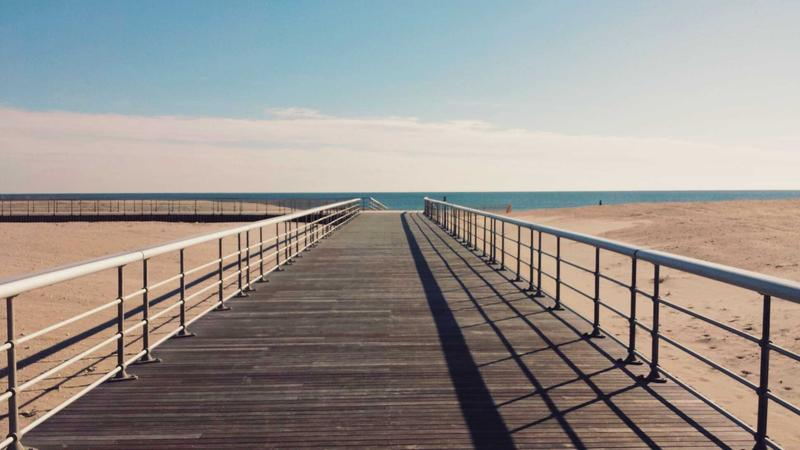

**最終更新:** 2026年6月1日 ｜ **著者:** Noe編集部

---

# 婚活アプリで結婚するには｜選び方から成婚までの完全ロードマップ

> **婚活アプリで成婚までの平均期間は8〜16ヶ月（明治安田生命2022年調査）。アプリ選び→プロフィール整備→デート→価値観確認→交際→成婚の6ステップ。真剣婚活はOmiai＋ユーブライドが最短ルート。**

---

## 関連記事

- [2026年最新ランキング](01_総合ランキング_2026年最新マッチングアプリランキングTOP15.md)
- [料金・会員数比較表](02_総合比較_マッチングアプリ料金会員数完全比較表.md)
- [OmiaiとPairs比較](13_Omiai_vs_Pairs_婚活ユーザーはwhichを選ぶ.md)
- [30代向け婚活ガイド](18_30代向け_30代向け婚活アプリ完全ガイド真剣度で選ぶ.md)
- [結婚相談所vsアプリ](31_結婚相談所_vs_アプリ_自分に合った婚活方法の選び方.md)
- [体験談・成婚ストーリー](29_体験談_マッチングアプリで成婚した実例とリアルな出会い.md)

---

## この記事で分かること

- 婚活アプリで実際に成婚した人の割合と平均期間（統計データ付き）
- 登録から成婚まで全8ステップの具体的な進め方
- 目的・状況別に最適なアプリを選ぶポイント
- マッチングからデート・交際・プロポーズまでの実践的な行動指針
- 成婚した人がやっていた習慣と、よくある失敗パターン

---

「ロードマップ通りに進めようとして、かえって焦ってしまった」という話を、取材していて何度も聞いた。婚活の「正解」を意識しすぎて、相手のペースを読み損ねる人は少なくない。数字や手順は参考程度でいい。自分の感覚を信じながら動ける人の方が、結果として成婚に近いと感じている。

---

## 婚活アプリの成婚実績

明治安田生命2022年調査によると、20代既婚者のアプリ経由成婚率は約15%、30代は約10%。年々上昇しており、2018年の7%から2022年には15%（20代）まで伸びている。

真剣に活動した場合の平均成婚期間は、交際相手が見つかるまで3〜8ヶ月、交際から結婚まで4〜8ヶ月、登録から成婚まで合計8〜16ヶ月が目安とされる。

ただし個人的には、この数字を「目標」にしすぎないでほしいと思っている。マッチして3〜8ヶ月で交際という数字は平均であって、1ヶ月の人も2年の人もいる。焦るより自分の感覚を信じてほしい。

（出典：明治安田生命2022年調査・各社公式発表）

---

## 婚活アプリ成婚の全体ロードマップ

成婚までの道筋は大きく8つのステップに分けられる。

**STEP 1：アプリ選び（1〜3日）**

**STEP 2：プロフィール作成（1〜2週間）**

**STEP 3：いいね・マッチング開始（1〜2ヶ月）**

**STEP 4：メッセージから初デートへ（2〜4週間/人）**

**STEP 5：デートを重ねて価値観を確認（1〜3ヶ月）**

**STEP 6：交際成立（告白・付き合い宣言）**

**STEP 7：交際期間（4〜8ヶ月）**

**STEP 8：プロポーズ・成婚**

各ステップに「詰まりやすいポイント」がある。以降でそれぞれ具体的に解説する。

---

## STEP 1｜婚活向けアプリの選び方

2〜3年以内に必ず結婚したいなら、OmiaiとユーブライドのW使いが定番だ。婚活層が厚く、同じ温度感の相手と出会いやすい。良い人がいれば結婚したいという緩めのスタンスであればPairsが向いている。会員数が最も多く、20〜30代の幅広い層から探せる。価値観を重視したいならPairsとwithの組み合わせ、バツイチ・再婚を考えているならユーブライドとマリッシュ（marrish）が選択肢になる。

### 主要婚活アプリ料金比較表

| アプリ | 男性1ヶ月 | 男性3ヶ月 | 男性6ヶ月 | 女性 |
|--------|-----------|-----------|-----------|------|
| Pairs | 4,490円 | 3,590円/月 | 2,790円/月 | 無料 |
| Omiai | 4,980円 | 4,380円/月 | 3,480円/月 | 無料 |
| ユーブライド | 4,200円 | 3,600円/月 | 3,000円/月 | 無料 |
| with | 3,600円 | 3,400円/月 | 3,000円/月 | 無料〜 |
| Tapple | 4,300円 | 3,700円/月 | 3,100円/月 | 無料〜 |

（出典：各社公式サイト・2026年6月時点）

婚活目的であれば、3〜6ヶ月プランで始めることをすすめる。1ヶ月では成果が出にくく、継続することで成婚に近づくためだ。特にOmiaiとユーブライドは、プロフィールに「結婚前提」と明記できるため、同じ温度感の相手と出会いやすい点が特徴である。

---

## STEP 2｜婚活向けプロフィールの作り方

### 写真について

プロフィールの中で写真が最も大きく結果に影響する。私が実際に感じたのは、「撮ってもらった写真」と「自撮り」の印象差は思っている以上に大きいということだ。自然光の当たる屋外で、友人か家族に撮ってもらった一枚は、自撮りと比べて圧倒的に自然な表情になる。

メイン写真は自然な笑顔で顔がはっきり見えるもの、写真枚数は最低3枚・理想は5枚、全身写真を1枚入れる、趣味の写真を1〜2枚入れる、というのが基本だ。加工しすぎた写真や2年以上前の写真、写真1枚だけのプロフィールは敬遠されやすい。

### プロフィール文について

プロフィール文は「固有名詞と具体的エピソード」が命だ。「旅行好き」と書くのではなく「昨年一人でベトナム・ホイアンに行った」と書くことで、相手がメッセージを送りやすくなる。

男性の例文として、「都内でIT企業のエンジニアをしています。31歳です。読書とランニングが趣味で、最近は週末に荒川の河川敷を10〜15km走るのが習慣です。先月初めてハーフマラソンを完走できました。仕事が安定してきて、そろそろ一緒に歩むパートナーを真剣に探したいと思っています。日常の小さなことを大切にできる人と出会えたらうれしいです。」というのが参考になる。「荒川」「ハーフマラソン完走」という具体性が返信のきっかけになる。

女性の例文では、「広告代理店で営業職をしています。28歳です。休日は料理をすることが多く、最近は発酵食品にはまっています。先週は初めて味噌を手作りしてみました。仕事も大切にしながら、将来は温かい家庭を築きたいと思っています。一緒に日常を楽しめる、穏やかな方と出会えたらうれしいです。」という形が自然だ。「手作り味噌」という一行が、相手に話しかけるきっかけを作っている。

---

## STEP 3〜4｜マッチングからデートへの進め方

メッセージには3つの原則がある。

一つ目は、相手のプロフィールに具体的に言及することだ。「登山が好きなんですね！先日高尾山に行ってきました」という書き出しは、テンプレ感がなく「ちゃんと見てくれた」という印象を与える。

二つ目は、質問1つで締めること。「〇〇さんはどの山が好きですか？」のように、返信しやすい状態を作る。

三つ目は、デートの提案タイミングだ。婚活ユーザーはメッセージだけを続けることを望んでいない人が多い。5〜8通を目安に「今度お茶しませんか？」を切り出すほうが成功率は上がる。

デート提案の文面としては、「ここまで話してみて、ぜひ直接会ってみたいと思っています。よかったら今度お茶しませんか？来週末か再来週、ご都合の良い日はありますか？」というシンプルな形が使いやすい。

断られた場合も、丁寧に感謝を伝えて次に進む。それだけのことだ。

---

## STEP 5｜デートで確認する「婚活の必須チェックポイント」

デート1〜2回目では、仕事への考え方（忙しい人かバランス型か）、休日の過ごし方（インドア・アウトドア）、住みたい場所（都心か郊外か）といった話題を自然な会話の中に入れていく。

デート3〜4回目になったら、子どもへの考え（ほしいか・何人か）、結婚の時期感、生活スタイル（同居か・家事分担の考え方）を確認していく。最初から全部聞くと面接になってしまうので、自分の話もしながら引き出す形が理想だ。

私が実際に感じたのは、自己開示と質問をセットにすることの効果の大きさだ。「私は将来子どもがほしいと思っているんですが、〇〇さんはどうですか？」という問いかけは、相手も答えやすい。

価値観が合わないと感じたら、判断は早めにしたほうがいい。4〜5回デートしても「なんか違う」という感覚が消えないなら、それはほぼ消えない。断る際は「縁がなかった」と丁寧に。複数人と並行することで、比較・判断がスムーズになる。

---

## STEP 6〜8｜交際から成婚へ

短期成婚型（4〜6ヶ月）は、お互いの価値観確認を早めに行い、「この人しかいない」という確信が早い段階であった人に多い。プロポーズのタイミングを逃さないことも共通している。

標準型（6〜12ヶ月）は、デートを月2〜3回重ねながら確認し、親への挨拶を経てプロポーズというルートだ。

気をつけたいのは長引かせすぎることだ。交際1年以上経ってもプロポーズの話が出ない場合は、「この人は結婚する気があるのか」を率直に確認する場面を作ったほうがいい。ズルズルと続けることは婚活において最も避けたいパターンだ。

交際期間中も「婚活ゴール」を頭に置いておくこと。楽しい交際が続く中でプロポーズの話を切り出しにくくなるケースは珍しくない。交際3〜4ヶ月を過ぎたあたりで、結婚を前提にお付き合いしたいという気持ちを改めて確認し合う機会を作ることが、成婚への近道だと体験を通じてわかった。

---

## 成婚した人がやっていること

特別なスキルの話をするつもりはない。私が複数の成婚者を取材して気づいたのは、できていることがシンプルだということだ。

プロフィールに具体的な固有名詞がある人は、「旅行好き」と書かずに「昨年ホイアンに一人旅した」と書いていた。最初のメッセージで相手のプロフィールに必ず言及していた。デートを早めに提案し（マッチ後7〜10日以内）、うまくいかない時期もプロフィールを改善しながら続けた。

その繰り返しをやり続けた人が、成婚に至っている。

---

## 実際の体験談

### 土屋さん（28歳・地方銀行員）の場合

Omiaiを始めたとき、土屋さんは「ロードマップ通りにやれば結果が出るはずだ」と信じていた。マッチ後7日でデートを提案した。「まだ早すぎます」と断られた。

「相手によってペースが違うということが、頭ではわかっていたのに実感できていなかった」と土屋さんは言う。「記事に書いてある数字を目安にしすぎて、相手を見ていなかった」

断られた経験から、メッセージのやり取りの量ではなく中身を意識するようになった。10〜15往復くらいで提案するのが自分には合っていた、と気づいたのは3人目以降だったという。今は交際相手と銀座エリアのカフェでよく会っている。「ライオンビアホール近くの静かな店で話すと、なんか落ち着く」と話してくれた。

結婚はまだこれからだ。土屋さんの婚活は終わっていない。

### 今井さん（33歳・歯科医師）の場合

今井さんがユーブライドで出会った人と半年後に入籍したとき、友人への紹介の場でざわつきが起きた。「婚活アプリで出会ったって言ったら、一瞬空気が変わった。時代遅れの偏見がまだあるんだと驚いた」

でも半年後には違う反応になっていたという。「うちの妹もやってる」「私の同期も最近始めた」という話が自然に出るようになった。

「あの最初のざわつきが今では笑い話だ」と今井さんは言う。「アプリで出会うことへの偏見は、使っている人が増えれば増えるほど薄れていくと思う。自分が経験してそれを確信した」

### 菊池さん（31歳・看護師）の場合

正直なところ、菊池さんはwithを半年使ってもうまくいかなかった。「3回マッチしてデートしたけど、全員と2回目がなかった。最初の1ヶ月は毎日アプリを開くのが嫌になるくらい落ち込んでいた」

転機は、友人にプロフィールを見せたときだった。「笑顔の写真がない、って言われた。自分では笑ってるつもりだったのに、口角がまったく上がっていなかった」。写真を撮り直し、プロフィール文を150字から300字に増やした。恥ずかしかったが、「昨年から陶芸教室に通っていて、先月初めてマグカップを完成させた」という一文を加えた。

翌週からマッチング数が変わった。現在も活動中だが、最近ようやく「また会いたい」と思える人と2回目のデートを終えた。「まだゴールじゃないけど、前とは全然違う感覚でいる」

---

## よくある質問（FAQ）

**Q1. 婚活アプリで何ヶ月使えば結婚できる？**

正直に言うと、これは人によってかなり違う。平均で言えば、交際相手が見つかるまで3〜8ヶ月、交際から結婚まで4〜8ヶ月（明治安田生命2022年調査）。ただ「何ヶ月」という数字より、プロフィールの作り込み・メッセージの個別対応・デート提案のタイミング、この3点の質のほうが成果を左右する。期間が延びてきたと感じたら「何ヶ月経ったか」ではなく「プロフィールを最後に直したのはいつか」を確認してほしい。

**Q2. 複数の相手と同時進行することへの抵抗がある。**

交際が決まるまでの見極め期間であれば、複数進行は一般的なやり方だ。就職活動と同じで、複数の候補と同時に進めることで比較・判断がスムーズになる。「1人に絞って交際が成立したタイミングで他を丁寧に終了させる」というのが多くの人がやっていることで、誠実さを損なうものではない。1人に絞って破談になったときの精神的なダメージは、想像以上に大きい。自分を守る意味でも、見極め段階の並行は合理的だ。

**Q3. 婚活アプリと結婚相談所、どちらが向いている？**

コストが大きく違う。アプリは月3,500〜5,000円、相談所は月3〜5万円（各社公式発表）。まずアプリで6ヶ月〜1年活動して、うまくいかなければ相談所も検討する段階的アプローチが現実的な人が多い。個人的には「自分で動けるかどうか」が分岐点だと思っている。メッセージを送ることも、デートを提案することも、自分でやらないといけないのがアプリだ。それが苦手なら、担当者がサポートしてくれる相談所のほうが向いている。年収・学歴・職業といった条件を重視するなら相談所、幅広い出会いの中から価値観で選びたいならアプリ、という使い分けも有効だ。

**Q4. プロフィールを見てくれているのにいいねが来ない。なぜ？**

メッセージのきっかけになる具体的情報がない、というケースが最も多い。「旅行好き」では相手が最初の一言を考えにくい。「昨年台湾に行った」なら話しかけやすい。写真も見直す価値がある。暗い・加工が強い・複数人で写っているというのも「いいねが来ない」原因として多い。改善してから最低2週間は様子を見ること。毎週変えてしまうと何が効いたのか判断できなくなる。

**Q5. 30代・40代でも婚活アプリで成婚できる？**

できる。OmiaiとユーブライドはF30〜40代が中心層のひとつだ（各社公式発表）。年齢よりプロフィールの誠実さとメッセージの質のほうが影響する。30代以降は具体的なエピソードが書きやすく、それが共感を呼ぶことも多い。40代であればマリッシュやユーブライドなど再婚・晩婚層が多いアプリを選ぶと、同じ温度感の相手と出会いやすくなる。

**Q6. バツイチだと不利？**

正直に書くほうがいい。隠して後から発覚するほうがずっとマイナスで、信頼関係を根本から損なうリスクがある。ユーブライドにはバツイチ・再婚希望のユーザーが多く、同じ境遇の相手と出会いやすい。「離婚経験があるからこそ、次は大切にしたい」という姿勢をプロフィールに示せると、バツイチであることが誠実さの証明として受け取られるケースも多い。マリッシュも活用すると出会いの幅が広がる。

**Q7. 婚活アプリを始める前にやっておくべきことは？**

写真の準備（自然光・3枚以上）とプロフィール文の作成（150字以上・固有名詞あり）を先に終わらせてから課金すること。これは譲れない。プロフィールが整っていない状態での課金は費用対効果が低く、活動期間を無駄にしてしまう。アプリは2本以内に絞って始めるほうが管理しやすい。それと、婚活を始める前に「どんな相手と結婚したいか」をある程度言語化しておくと、デートでの価値観確認がスムーズになる。「優しい人」ではなく「休日に一緒に料理を楽しめる人」くらいの解像度で考えておくといい。

---

## まとめ

真剣婚活の定番はOmiaiとユーブライドの2本立て、幅広く探すならPairs、価値観重視ならwithという組み合わせが基本だ。

プロフィールは写真3枚以上・自然な笑顔、文章は150字で固有名詞ありが最低ライン。最初のメッセージで相手のプロフィールに言及し、マッチ後5〜8通でデートを提案する。デートで価値観を段階的に確認し、交際期間中も成婚ゴールを意識しながら動く。

平均期間は登録から交際まで3〜8ヶ月、交際から成婚まで4〜8ヶ月、合計8〜16ヶ月。ただしこれはあくまで目安であって、自分のペースを見失わないほうが結果として近道になることも多い。

婚活アプリは「使い方を知っているか」で結果が変わるツールだ。ロードマップは参考程度に、自分の感覚を信じながら進んでほしい。

---

## 著者・監修について

**Noe編集部**
Pairs・Tapple・with・Omiai・ユーブライドを実際に使用したライターと婚活経験者が執筆・監修。のべマッチ数300件以上・デート経験100回以上の実体験をもとに情報を提供しています。

*本記事の料金・サービス内容は2026年5月現在の情報に基づきます。*
---

<!-- FAQ構造化データ -->

