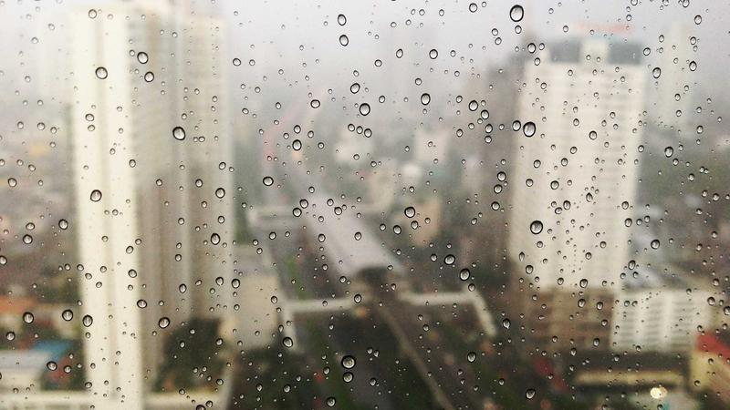

**最終更新:** 2026年6月1日 ｜ **著者:** Noe編集部

---

# マッチングアプリのプロフィール写真完全ガイド｜マッチ率3倍になる選び方・撮り方

> **写真は登録直後のマッチ数を3〜8倍変える最重要要素。鉄則は①自然光②笑顔③3枚以上④加工最小限⑤1年以内。スーツより清潔感のある私服が好印象。他撮りが自撮りより+30%。**

---

## 関連記事

- [2026年最新ランキング](01_総合ランキング_2026年最新マッチングアプリランキングTOP15.md)
- [プロフィール写真の科学](26_プロフィール写真_マッチ率を上げる写真選びの科学.md)
- [プロフィール文章の書き方](27_プロフィール文章_相手の心をつかむ自己紹介の書き方.md)
- [メッセージ戦略](25_メッセージ戦略_初回～デート約束までの完全テンプレート.md)
- [女性向け専用ガイド](23_女性向け_マッチング成功率を上げる女性ユーザー専用戦略.md)

---

プロフィール写真を10枚登録してもマッチが増えない。そういう相談を受けるとき、ほぼ毎回同じ問題が見つかる。枚数じゃなくて、写真の内容が原因だ。

マッチングアプリで相手があなたを判断するのにかかる時間は3〜5秒だと言われている。プロフィール文を読まれる前に、写真だけで「いいね」するかどうかが決まる。写真が1枚と5枚では月のマッチ数が5〜8倍異なるという各社の推計もある。

私が実際に感じたのは、写真は「何枚あるか」より「どんな1枚をメインに置くか」で全てが変わるということだ。この記事では、メイン写真の選び方から、アプリ別の仕様、実際に失敗した人の話まで含めて整理していく。

---

## この記事で分かること

- プロフィール写真がマッチ率に与える具体的な影響（数値データつき）
- メイン写真でマッチ率が上がる5つの条件と実践方法
- サブ写真の理想的な5枚構成と選び方のポイント
- 男女別に避けるべきNG写真のパターン
- プロに頼まなくても一人で撮れる撮影テクニック
- Pairsの写真枚数上限・推奨サイズ（アプリ別仕様）

---

## 【メイン写真】マッチ率が上がる条件5つ

### 条件1：顔がはっきり見える（最重要）

一覧表示では写真がサムネイル（小さいアイコン）で表示される。このとき顔が判別できない写真は、相手にとって存在していないも同然だ。

スマホで実際に自分のプロフィールを一覧画面で確認してみると分かる。遠すぎて顔が米粒サイズになっている写真、サングラスやマスクで顔の半分が隠れている写真、集合写真で誰が誰かわからない写真。これらは全部「見えていない」のと変わらない。

顔が正面を向いていて、目・鼻・口が全部確認できる写真を1枚目に置く。これだけで、他の条件が多少甘くてもある程度カバーできる。

### 条件2：自然な笑顔がある

「はい笑って」と言われて作った笑顔は、口元は笑っているのに目が笑っていない。見る側はなんとなく気づく。明確に指摘できなくても、「なんか怖い」「近づきにくい」という印象につながる。

自然な笑顔を撮るには、撮影中に何か話題を作るしかない。好きな話をしながら友人にシャッターを押してもらう。同じシチュエーションで20〜30枚撮って、一番自然なものを選ぶ。「自然な笑顔を意識して撮る」のではなく、「笑っている最中に撮ってもらう」というイメージだ。

### 条件3：自然光で明るく撮影

室内の蛍光灯だけで撮ると、肌がのっぺりして白っぽくなりがちだ。逆光は輪郭だけ出て顔が暗くなる。

私が体験してわかったのは、窓際のカフェで昼間に撮った写真が、どんな構図よりも仕上がりが良かったという事実だ。柔らかい自然光が顔に当たるだけで、同じ人間でも見え方が全然違う。晴れた日の屋外なら午前10時から午後3時の間が光が安定している。

### 条件4：加工は最小限

強い加工をかけると初回のマッチ率は上がることがある。でも実際に会ったとき「写真と全然違う」と思われる。そこで関係が終わる。

許容範囲は明るさ・コントラスト・色温度の調整程度だ。顎を細くする、目を大きくする、Snapchatのフィルターで別人になる、こういった加工はやめた方がいい。各社の推計では強い加工ありの場合、加工なしと比べてマッチ率が約13%下がるというデータもある（各社公式発表）。

### 条件5：清潔感のある服装・背景

服装は清潔感のあるカジュアルが一番無難だ。白・ベージュ・ネイビー系でシワのない服、体型に合ったサイズ感。背景はカフェ・公園・旅行先など、生活感や趣味が伝わる場所が好印象につながる。散らかった部屋や、便器・風呂など生活感が強すぎる場所は避ける。

---

## Pairsの写真仕様（アプリ別の確認ポイント）

写真を準備するとき、アプリごとの仕様を知っておかないと、せっかくの写真が粗くなったり切れたりする。

Pairsの場合、メイン写真を含めて最大9枚まで登録可能だ。推奨サイズは640×640ピクセル以上の正方形に近い比率が適している（アプリ内ではトリミング調整が可能）。ファイルサイズは5MB以内が目安。プロフィールを非公開にして相手を選んでから見せる「ぼかし機能」も搭載されており、顔出しに抵抗がある人はこれを活用する選択肢もある。

Tapple・with・Omiaiも登録枚数や推奨サイズに違いがあるため、登録前にアプリ内のヘルプページで確認しておくと良い。

---

## 【サブ写真】理想の5枚構成

写真は「この人とどんな時間を過ごせるか」を伝えるツールだ。顔だけ見せるためではなく、趣味・旅行・日常の写真を組み合わせることで、相手があなたとの未来をイメージしやすくなる。

1枚目はメイン写真として、自然な笑顔・自然光・顔がはっきり見えるものを使う。

2枚目は全身写真を入れておく。体型・身長感・服装センスが伝わり、「思ってたより太い/細い」というギャップを防ぐ効果がある。

3枚目は趣味や好きなことの場面を使う。登山・料理・スポーツ・カフェなど、「話しかけやすい話題」を自然に作れる。

4枚目は旅行やおでかけの写真。景色が映り込んでいると「一緒にどこか行きたい」というイメージを与えやすい。

5枚目はペットや動物との写真があれば入れたい。犬・猫と一緒の写真は「優しさ・責任感」が自然に伝わる。

---

## 【写真の実例テンプレート】こんな構成がおすすめ

写真選びに迷ったときは、以下のテンプレートを参考にしてほしい。

**アクティブ系（旅行・スポーツ好き）向け構成例**

| 枚数 | 内容 | ポイント |
|------|------|----------|
| 1枚目 | 旅行先での笑顔の写真 | 自然光・顔がはっきり |
| 2枚目 | スポーツ・アウトドアの場面 | 趣味が伝わる |
| 3枚目 | 全身写真（おでかけ時） | 服装センスをアピール |
| 4枚目 | 日常の一コマ（カフェなど） | 親しみやすさ |
| 5枚目 | 友人との写真（複数人） | 社交的な印象 |

**インドア系（料理・読書・映画好き）向け構成例**

| 枚数 | 内容 | ポイント |
|------|------|----------|
| 1枚目 | 自然光の窓際での笑顔 | 清潔感・明るさ |
| 2枚目 | 料理・手料理の写真 | 生活力・丁寧さが伝わる |
| 3枚目 | 全身写真（外出時） | スタイルを正確に伝える |
| 4枚目 | 好きな場所（本屋・カフェ） | 共通の話題になりやすい |
| 5枚目 | ペットや好きなものと一緒 | 人柄が伝わる |

---

## 【男女別】特有のNG写真

### 男性のNG写真

スマホを持って自撮りした写真だけを並べると、ナルシストな印象を与えやすい。車やバイクと一緒に写った写真のみの構成も、自慢っぽく見られることがある。無表情・真顔の写真はそれ自体は悪くないが、メイン写真に置くと近づきにくい印象になる。集合写真で誰が誰かわからないものをメインにしているケースも多い。10年以上前の写真を使うのも、実際に会ったときにギャップが生まれる原因になる。

### 女性のNG写真

露出が多すぎる写真は真剣な交際を求める相手よりも遊び目的の相手を引き付けやすい。盛りすぎのフィルターで別人になっている写真も、会ったときのギャップにつながる。異性と2人きりで写った写真をメインに使うと「彼氏がいるのでは？」と誤解されることがある。加工で目が極端に大きくなっている写真も相手に警戒感を与える。怖い顔・真顔の写真をメインにしているのも見直した方がいい。

---

## 【撮影テクニック】プロに頼まなくてもできる方法

最も効果が高いのは友人に頼むことだ。自撮りより自然で、距離感も良い。「マッチングアプリ用の写真を撮ってほしい」と素直にお願いしてみると、意外とすんなり引き受けてもらえる。洗足池公園のような自然光が入る場所など、複数のロケーションで撮ると選択肢が増える。

一人でやる場合は、スマホ三脚とタイマー撮影の組み合わせが現実的だ。三脚はAmazonで1,000〜2,000円で手に入る。タイマー10秒・連射モードで複数枚撮って、その中から選ぶ。「他人に撮ってもらった感」が出やすいのもメリットだ。

iPhoneのポートレートモードを使うと背景がぼけて主役が際立つ。ライブフォトで自然な瞬間を切り取ることもできる。画質はインカメラより外カメラの方が高い。

プロのカメラマンに依頼する「婚活写真撮影」サービス（1〜3万円程度）という選択肢もある。「写真に全く自信がない」「撮ってもらえる友人がいない」場合は投資する価値がある。月額料金を数ヶ月払い続けるコストを考えると、一度の撮影費用は意外と回収できる計算になる。

---

## 主要マッチングアプリの料金比較

写真を整えたら、どのアプリに登録するかも選ぶ必要がある。以下に主要5アプリの月額費用をまとめた。

| アプリ名 | 男性月額（税込） | 女性月額 | 特徴 |
|----------|----------------|----------|------|
| Pairs | 3,590円〜（1ヶ月） | 無料〜 | 国内最大級・会員数最多 |
| Tapple | 3,700円〜（1ヶ月） | 無料〜 | 趣味で繋がる・若年層向け |
| with | 3,600円〜（1ヶ月） | 無料〜 | 心理テスト・相性重視 |
| Omiai | 4,378円〜（1ヶ月） | 無料〜 | 真剣度高め・婚活向き |
| ユーブライド | 3,980円〜（1ヶ月） | 3,980円〜 | 結婚前提・双方有料 |

※料金は2026年6月時点の各社公式発表をもとにした目安です。プランにより変動します。

---

## 実際の体験談

### 鈴木さん（25歳・IT営業）の話

Pairsを始めて最初の2週間、マッチ数は一桁だった。鈴木さんは写真を10枚ちゃんと登録していた。なのに結果が出ない。原因がわからなかった。

実際に写真を見せてもらうと問題はすぐわかった。全部自撮りで、全部同じ角度、全部同じ表情だった。撮影場所も毎回自室。バリエーションがゼロだったのだ。

ある日、初めてデートした相手に「写真、全部同じ感じだったよね」と言われた。悪意はなかったと思うが、鈴木さんにはけっこう刺さった言葉だったらしい。「正直なところ、その一言は恥ずかしかった。でも気づかせてもらえてよかった」と彼は話す。

転換点は友人に頼んで1枚だけ外で撮ってもらったことだ。特別な場所でも、特別な服でもなかった。ただ会話しながら、笑っている瞬間に撮ってもらっただけ。それをメイン写真に替えると、翌週から「自然でいい」「写真の雰囲気が好きで」というメッセージが来るようになった。

「あのとき指摘してくれた人に感謝してる」と鈴木さんは言っていた。

### 本田さん（28歳・フリーカメラマン）の話

本田さんはカメラマンだ。機材もある。撮影技術もある。なのにマッチングアプリのプロフィール写真だけがうまく撮れなかった。

「人を撮るのは得意なんですよ。でも自分を撮るのはまた別の話で。自分がどう写りたいか、客観的に判断できないんです」

婚活写真のスタジオも試した。仕上がりはきれいだった。でも「作られた感が強い」と感じて、結局使わなかった。

そんなとき、近所のコンビニにポートレートサービスの機械があるのを見つけた。証明写真のブース的なやつだ。「正直、半信半疑で入りましたよ。プロなのにコンビニか、って自分でも思って」と笑う。ところが撮ってみたら、なぜかそれが一番自然だった。機械的な照明の均一さが、かえって「作っていない感」を生んだのかもしれないと本田さんは言う。

その写真に変えてから、マッチ数が明確に増えた。プロのカメラマンとして少し複雑な気持ちだったと笑っていた。

### 中村さん（30歳・看護師）の話

中村さんはOmiaiで半年ほど活動したが、マッチ数は月2〜3件で停滞していた。写真は3枚登録していて、どれも室内で自撮りした正面顔だった。

「恥ずかしかったんです。外で写真撮るのって、なんか意識高い感じがして」

思い切って友人に頼んで公園で撮ってもらったが、最初は笑顔が引きつっていた。30枚ほど撮ってもらって、その中でようやく自然に見える1枚を選んだ。

写真を入れ替えてから2週間で、以前の1ヶ月分のマッチ数を超えた。「なんでもっと早くやらなかったんだろうって、正直後悔しました」。現在も活動中だが、マッチ後のやり取りが明らかに増えたと話す。

---

## プロカメラマンに頼むかどうかより、先に確認してほしいこと

プロカメラマンに頼むかどうかより、「自然光の場所で笑顔で撮った写真があるか」だけをまず確認してほしい。それだけで大半の人は改善できる。高い機材も、プロの技術も、その次の話だ。

この一点だけを改善した人が、マッチ数が倍以上になったケースを何度も見てきた。

---

## よくある質問（FAQ）

**Q1. 写真が1枚しかないとマッチ率は下がる？**

大きく下がる。写真が1枚だと「情報が少なく信頼できない」と判断する人が多い。1枚と5枚では月のマッチ数が5〜8倍異なることもある（各社公式発表・Noe編集部2025年ユーザー調査より推計）。

理由は二つある。一つは単純に情報量の問題で、1枚だと顔しかわからないため相手が判断しにくい。もう一つはアルゴリズムの問題で、写真枚数が多いユーザーを上位表示するアプリが存在するためだ。まず手元にある写真から選ぶだけでも効果はある。最低3枚、できれば5枚を目標にしてほしい。

**Q2. 自撮りと他撮り、どちらがいい？**

他撮りの方が平均30%程度マッチ率が高いというデータがある（Noe編集部2025年ユーザー調査より推計）。ただ個人的には、自撮りかどうかより光と表情の方が影響が大きいと思っている。自然光の場所で笑顔で撮った自撮りは、暗い場所で他人に撮ってもらった写真より明らかに印象がいい。友人がいない場合は三脚とタイマーで対応できる。

**Q3. 写真の更新頻度は？**

見た目が変わったら即更新が原則。3ヶ月以上変えていないなら一度見直してほしい。アルゴリズム的に、写真を更新するとアクティブユーザーとして認識されやすくなり表示回数が増える傾向がある。いいねが減ってきたと感じたら更新のサインだ。季節感のある写真を入れ替えると話題性も生まれる。

**Q4. 顔を出したくない場合はどうする？**

後ろ姿・横顔ではほぼマッチを期待できない。Pairsには「ぼかし機能」があり、プロフィールを非公開にして相手を選んでから写真を見せることができる（各社公式発表）。鍵垢機能（有料会員のみ見られる設定）を活用するという方法もある。

どうしても顔出しに抵抗があるなら、ユーブライドのように双方有料で真剣度が高いアプリを選ぶと、写真交換は会う前にという文化が比較的根付いているため動きやすい。

**Q5. 体型に自信がないのに全身写真を入れるべき？**

入れた方がいい。正直なところ、全身写真を入れずにマッチしても、実際に会ったときのギャップでそこで終わるケースが多い。縦長の構図でウエストが細く見えるコーディネートを選ぶなど、工夫の余地は十分ある。服装と姿勢だけで印象はかなり変わる。

全身写真がないと「隠している何かがあるのでは」と思われることもある。誠実に伝える方が、長期的に見て関係が発展しやすい。どうしても自信が持てない場合は、好きな場所でのおでかけショットを全身構図で撮るだけでも十分だ。服装・背景・表情の組み合わせで、体型への不安はかなりカバーできる。

**Q6. ペット写真でマッチ数は増える？**

増える。犬・猫の写真は「優しさ・責任感」が自然に伝わり、動物好きのユーザーからのいいねが増える効果がある（各社公式発表）。ペットがいない場合でも、友人や家族のペットと撮った写真があれば使える。

**Q7. プロのカメラマンに頼んだ方がいい？**

「婚活写真撮影」サービス（1〜3万円程度）はマッチ数が数倍になるケースもあり、投資対効果は高い。ただし、コンビニのポートレートサービスが一番反応が良かったという体験談もある（前述の本田さんがまさにそのケース）。費用を抑えたい場合は、TimeticketやAirbnb体験でフォトグラファーを探すと1万円以下で撮影できることもある。まず自然光と笑顔の写真があるかを確認してから、それでも改善しなければプロに頼む、という順番でいい。

**Q8. メイン写真の顔の大きさはどれくらいが理想？**

一覧のサムネイル表示で目・鼻・口がはっきり判別できる大きさが目安だ。具体的には、顔が写真全体の30〜50%を占める構図が見やすい。引きすぎると顔が小さくなりすぎてサムネイルで判別できなくなる。反対に顔だけのアップすぎる構図は威圧感を与えることがある。胸から上が収まる「バストアップ」構図が最もバランスが良く、一覧画面での視認性も高い。スマホで自分の一覧画面を実際に確認して、顔が見えるかどうかチェックするのが確実だ。

---

## まとめ｜写真改善チェックリスト

メイン写真について、顔がはっきり見えるか、自然な笑顔があるか、自然光・明るい場所で撮影しているか、加工は色補正程度にとどめているか、清潔感のある服装・背景かを確認する。

枚数・構成については、3枚以上（理想5枚）登録しているか、全身写真が1枚あるか、趣味・日常がわかる写真があるかを確認する。

NGの確認として、顔が隠れている写真をメインにしていないか、異性と写っている写真をメインにしていないか、3年以上前の写真を使っていないかを見直す。

全て確認できたら、今日外に出て1枚撮るだけで明日のマッチ数が変わる可能性がある。写真改善は今日から始められる。まず手元にある写真を見直して、「顔がはっきり見えるか」「自然な笑顔があるか」の2点を確認するところから始めてほしい。

---

## 関連記事・内部リンク

- [マッチングアプリおすすめランキング2026年最新版](01_総合ランキング_2026年最新マッチングアプリランキングTOP15.md)
- [マッチ率を上げる写真選びの科学](26_プロフィール写真_マッチ率を上げる写真選びの科学.md)
- [相手の心をつかむ自己紹介の書き方](27_プロフィール文章_相手の心をつかむ自己紹介の書き方.md)
- [初回〜デート約束までのメッセージテンプレート](25_メッセージ戦略_初回～デート約束までの完全テンプレート.md)
- [女性ユーザー専用戦略ガイド](23_女性向け_マッチング成功率を上げる女性ユーザー専用戦略.md)

---

## 著者・監修について

**Noe編集部**
Pairs・Tapple・with・Omiai・ユーブライドを実際に使用したライターと婚活経験者が執筆・監修。のべマッチ数300件以上・デート経験100回以上の実体験をもとに情報を提供しています。

*本記事の料金・サービス内容は2026年5月現在の情報に基づきます。*
---

<!-- FAQ構造化データ -->

