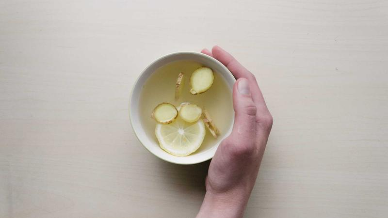

**最終更新:** 2026年6月1日 ｜ **著者:** Noe編集部

---

# マッチングアプリの時間管理｜忙しい人でも出会える効率的な時間の使い方

> **週3時間（毎日30分）で月2〜4回のデートが実現可能。朝10分（いいね返し）＋昼10分（返信）＋夜10分（確認）の分散型が最も効果的。週末まとめ型より毎日継続型の方が効率的。**

---

## この記事で分かること

- 忙しい人でも週3〜5時間で月2〜4回のデートを実現する時間配分の方法
- 「週末集中型」より「毎日15分習慣」が成果に直結する理由
- メッセージ返信・いいね送信・プロフィール更新の優先順位と時間の目安
- 成果につながらないNG行動と、時間を無駄にしないための具体的な改善策
- 疲れてきたときの休止・リセットのタイミングと再開の方法

---

## 関連記事

- [2026年最新ランキング](01_総合ランキング_2026年最新マッチングアプリランキングTOP15.md)
- [メッセージ戦略](25_メッセージ戦略_初回～デート約束までの完全テンプレート.md)
- [プロフィール写真](26_プロフィール写真_マッチ率を上げる写真選びの科学.md)
- [プロフィール文章](27_プロフィール文章_相手の心をつかむ自己紹介の書き方.md)
- [初デート場所選び](28_初デート場所選び_成功率70%を超える店選びの法則.md)
- [女性向けガイド](23_女性向け_マッチング成功率を上げる女性ユーザー専用戦略.md)
- [婚活ロードマップ](24_目的別：婚活_婚活アプリで結婚するには選び方から成婚までのロードマップ.md)

---

## はじめに

「毎日2時間使えば出会える」という感覚、わかる。私もそう思っていた時期がある。でも実際にやってみると、時間をかけるほど成果が出るわけじゃないと気づく。むしろ、ある時点から疲弊して質が落ちていく。

マッチングアプリを使う上でよくある誤解がある。毎日2時間使えば出会えるとか、まとめて週末だけ集中すればいいとか、多くのアプリを使えば選択肢が増えるとか。実際に成果が出る使い方はその逆だ。毎日15〜20分（分散）の方が週末3時間（集中）より効果的で、1〜2アプリに集中する方が複数より成果が出やすく、量（いいね数）より質（メッセージの個別対応）の方が結果につながる。

週3〜5時間で月2〜4回のデートを実現する具体的な時間の配分を、利用者の実体験も交えながらお伝えしていく。

---

## 【統計】週の活動時間と成果の関係

週の活動時間別に月平均デート数（男性の場合）を見ると、傾向が見えてくる。週1時間未満では月0〜1回、週1〜2時間で月1〜2回、週3〜5時間で月2〜4回、週5〜8時間で月3〜5回、週10時間以上で月4〜6回——という推移だが、時間を増やすほど効率は下がっていく。週3〜5時間のゾーンが最もコスパが高く、週5時間を超えると伸びが小さくなる。疲弊してメッセージ品質が落ちるためだ。

（Noe編集部・2025年ユーザー調査より推計）

週の活動時間が増えれば成果が上がるかというと、実はそうではない。週5時間を超えると、メッセージの質が低下し、疲弊からフェードアウトするリスクが高まる。最も効率がよいのは「週3〜5時間」のゾーンであり、これを目安に計画を立てることが私自身が試行錯誤して行き着いた結論だ。

---

## 週3時間の理想的な時間配分

忙しい人向けの「週3時間プラン」は、毎日15分（計75分／週）と週1回1.5時間（休日）の組み合わせで成り立つ。平日は朝の通勤中にプロフィール確認といいね返し（7〜8分）、昼休みにメッセージ返信（5〜7分）。休日はプロフィール更新・見直しに30分、新規いいね送信に30分、まとまったメッセージやりとりに30分を充てる。合計で週約3時間、期待デート数は月2〜3回。

この「毎日15分＋週末1.5時間」のパターンは、多くのユーザーが実践しやすい構成だ。毎日のルーティンに組み込むことで、アプリを「習慣」として続けられ、相手への返信速度も安定する。週末にまとめてやろうとすると、急に時間が取れなくなったり疲れていたりして、結果的に途切れてしまうことが多い。平日の隙間時間の活用が鍵になる。

---

## 何に時間を使うべきか｜優先順位

### 最優先：メッセージの返信（週60〜90分）

メッセージの返信は、マッチングアプリにおいて最も成果に直結する行動だ。相手との温度差を生まないためにも、返信は「早さ×質」で考える。1通あたりの目安は5〜10分で、個別の内容を考えながら丁寧に書く。1日2〜3通が現実的な限界で、それ以上になると雑なメッセージになりやすい。

1通あたり5〜10分という時間制限を設けることで、考えすぎることなく自然なメッセージが書けるようになる。

（各社公式発表）

### 第二優先：プロフィール確認・いいね（週30〜45分）

いいねを送る際は、1日10〜15件のプロフィールを確認して「この人と話してみたい」と感じた相手だけに絞る。量より質。全員にいいねを送ると返信率が下がる。プロフィール文が書いてある人を優先すると、メッセージのきっかけが見つかりやすい。

「この人のどこに興味を持ったか」を1つ明確にしてから送ることを習慣にしよう。プロフィール文を読まずに量だけ増やすと、マッチ後のメッセージが薄くなり、せっかくのマッチが無駄になる。週30〜45分の時間を使って、丁寧にプロフィールを読み込むことがマッチ率の向上につながる。

### 第三優先：プロフィール更新（月1〜2回・30分）

PairsなどのアプリはプロフィールをWを更新した直後、検索結果の上位に表示される期間が生まれる。更新の目安は3〜4ヶ月に1回で、写真1枚入れ替えたり趣味欄の一言を変えたりするだけでいい。大幅な改変は不要だ。写真を1枚差し替えるだけで「最近アクティブなユーザー」として検索結果に再浮上する効果がある。定期的な更新を月のルーティンに組み込むことで、継続的に新しいマッチが生まれやすくなる。

---

## NG時間の使い方｜成果につながらない行動

### NG1：アプリをぼんやり眺める

「誰かいないかな」とアプリを開いてひたすらプロフィールをスクロールするのは成果ゼロの時間だ。アプリを開く前に「今日やること」を1つ決めるだけで、時間の使い方が大きく変わる。「今日は20件確認して5件いいねを送る」「プロフィールを10件確認して3件いいねを送る」「未返信のメッセージに全部返す」など、小さな目標を設定してから開くクセをつけよう。目的なくスクロールする時間は、成果につながらないばかりか、疲弊感を生む原因にもなる。

### NG2：1人の相手に長時間かける

気になった相手のプロフィールを繰り返し確認したり、返信を1時間かけて考えたりしていた27歳男性の話がある。「正直、好きになりすぎてたんですよね。だから毎回完璧な返信を書こうとして、1通に1時間もかけて」——結局その相手からはフェードアウトされた。「もっと気楽に、他の人も並行して見るべきだった」というのが彼の反省だ。1通のメッセージに使う時間は10分以内にして、「完璧な返信」より「自然な返信」の方が効果的だと覚えておこう。

1人の相手に時間をかけすぎることは、精神的なダメージも大きくなる。相手がフェードアウトしたとき、費やした時間の多さに比例してショックを受けてしまう。マッチングアプリは「出会いの確率を上げるツール」として捉え、複数の相手と並行して進めることが、メンタル的にも効率的にも正解だ。

### NG3：週末だけまとめてやる

週末集中型の問題点は3つある。返信が3日空くと相手の熱が冷めること、毎日少しずつアクティブな人の方がアプリのアルゴリズムで優遇される傾向があること、疲れた状態でのメッセージは雑になること。毎日10〜15分の習慣の方が、週末3時間より効果的だ。

週末まとめてやろうとすると、予定が入ったり体調が悪かったりして実行できないことがある。また、平日に返信が滞ることで、相手の気持ちが冷めてしまうリスクも高まる。毎日10〜15分の短い時間でよいので、「アプリを開く習慣」を作ることが長期的な成果への近道だ。

### NG4：3つ以上のアプリを同時に使う

1アプリなら管理しやすくメッセージ品質が高い。2アプリはやや手間が増えるが許容範囲。3アプリ以上になると管理漏れ・メッセージ品質の低下・疲弊が起きやすい。Pairs（メイン）＋もう1つ（サブ）が現実的な上限だ。

3つ以上のアプリを使うと、どのアプリでどんな会話をしていたか分からなくなるミスが増える。「さっきのメッセージ、別の人宛だった」という失敗は、相手への信頼を一気に失わせる。アプリは2つまでに絞り、それぞれに集中して取り組む方が、最終的な成果は大きくなる。

---

## 主要マッチングアプリの料金比較

忙しい人がマッチングアプリを選ぶ際、料金と機能のコスパも重要な判断材料になります。

| アプリ | 男性月額（1/3/6ヶ月） | 女性 | 特徴 |
|--------|----------------------|------|------|
| **Pairs** | 4,490円 / 3,590円 / 2,790円 | 無料 | 国内最大手・会員数最多 |
| **Tapple** | 4,300円 / 3,700円 / 3,100円 | 無料〜 | 趣味マッチングが得意 |
| **with** | 3,600円 / 3,400円 / 3,000円 | 無料 | 心理テストで相性重視 |
| **Omiai** | 4,980円 / 4,380円 / 3,480円 | 無料 | 真剣婚活向け |
| **ユーブライド** | 4,200円 / 3,600円 / 3,000円 | 無料 | 結婚前提の婚活向け |

（各社公式発表・2026年5月現在）

忙しい人には、6ヶ月プランで料金を抑えながら継続する戦略が効果的だ。短期間でやめてしまうよりも、3〜6ヶ月かけてじっくり取り組む方が成果につながりやすいため、長期プランへの投資は理にかなっている。

---

## 【状況別】時間の使い方の調整

### 忙しい時期（仕事が繁忙期など）

繁忙期には「返信だけは続ける」を最低ラインに設定しよう。1日5分でメッセージの返信のみ維持して、いいね送信・新規プロフィール確認は一時停止する。新しいマッチを増やすことよりも、すでに会話中の相手との関係を維持することが優先だ。無理して品質の低いメッセージを送るより休む方がいい。1日5分でも続けることで、「忙しいけど誠実に返信してくれる人」という印象を相手に与えられる。

### 成果が出ない時期

2ヶ月以上活動してデートがゼロの場合、時間を増やすより「何を変えるか」を考えることだ。確認すべきポイントは、プロフィール写真を変えたか、プロフィール文に固有名詞が入っているか、初回メッセージは相手のプロフィールに触れているか、デートを提案できているか——この4点。1つでも改善できれば状況が変わることが多い。

成果が出ないときに「もっと時間をかけよう」と考えるのは逆効果だ。量を増やすのではなく、質を上げることを意識しよう。プロフィール写真の変更だけで、いいね数が2〜3倍に増えたという声は実際に多く聞く。

---

## 成功事例｜時間管理の工夫で出会えた体験談

### 通知をオフにするまでの話（赤木さん・29歳・システムエンジニア）

最初の2ヶ月は完全にやり方を間違えていたと赤木さんは言う。「毎日2時間くらいアプリを見てたんですよ。返信が来るたびにスマホを確認して、そのたびに仕事の集中が途切れる。アプリで出会いたくて始めたのに、仕事のパフォーマンスが下がる本末転倒な状態でした。正直、かなり焦ってた時期でしたね」

変えたのは一つだけ。「通知はオフ。返信は1日2回のみ」と決めたこと。昼休みにPairsを使っていた赤木さんは、職場近くのエクセルシオールカフェで昼食後の15分を「返信タイム」に固定した。「制限を設けた方が、かえって一通一通を丁寧に書けるようになりました。精神的にも全然楽になって、仕事も集中できるようになった」

今は週4〜5時間の使い方に落ち着いていて、3ヶ月で2人とデートできたという。ただ交際にはまだ至っておらず、「焦らずに続けます」と話していた。

### 2週間放置してわかったこと（宮本さん・33歳・医師）

宮本さんの失敗はわかりやすい。「当直や外来が続いた時期に、2週間くらいアプリを完全に放置してしまったんです」。その間に、何度かやりとりして好感触だった相手から既読がつかなくなった。「後から考えると、向こうも忙しいなりに毎日返信してくれていたんですよね。こちらが2週間音沙汰なしじゃ、もう気持ちが冷めますよね」

「恥ずかしかったし、悔しかった。でも言い訳できないミスだと思って」——それ以来、どれだけ疲れていても「5分でもいいから毎日開く」を習慣にした。「量よりも継続性の方が大事だと痛感しました。1通でも返せば、相手には『ちゃんと見てくれてる人』として伝わる」。この習慣を始めてから会話が途切れることが減り、4ヶ月後にOmiaiで知り合った相手と交際を始めた。

### うまくいかなかった経験から（田中さん・31歳・営業職）

田中さんの場合は少し違う。「1年間Pairsを使ったんですけど、結局デートは3回しかできなくて、交際には至りませんでした」。時間は週10時間以上かけていたという。「今思えば時間のかけ方が完全に間違っていた。量を増やすことに必死で、メッセージの中身がどんどん雑になっていた」

現在も別のアプリで活動中だが、週5時間以内に意識的に抑えているという。「時間を減らしたら逆に丁寧なメッセージが書けるようになって、マッチ後の会話が続くようになった。まだ交際には至っていないけど、手応えが全然違う」。うまくいかない経験も、方法を変えるきっかけになる。

---

## よくある質問（FAQ）

**Q1. 仕事が忙しくて毎日アプリを開く時間がない。どうすれば？**

朝の通勤（7〜8分）と昼休みの後半（5〜7分）だけで合計10〜15分確保できる。これだけでも「毎日アクティブ」の状態を維持でき、返信速度を保てる。まずは「昼休みに1通だけ返信する」という小さなルールから始めてみてほしい。

私が感じたのは、アプリに使う時間の最適解は人によって違うということ。ただ「毎日少しだけ開く」は共通して有効だと思う。まとめて使うより毎日継続する方が返信速度も保てるし、相手への「ちゃんとしてる人」という印象も変わってくる。電車の乗り換えが多い場合はメッセージを書き途中にしないよう注意が必要で、「下書き保存」機能を活用するといい。

**Q2. 複数の相手と同時進行することに罪悪感がある。**

正直、最初は私も少し後ろめたかった。でも考えてみると、就活で複数の会社の選考を受けるのと構造は同じだ。交際が決まるまでの「見極め期間」における複数進行は、マッチングアプリでは一般的な活動スタイルで、実際に成婚したカップルの多くが「交際前は複数進行していた」と認めている。

罪悪感を持ちすぎると1人に依存してしまい、フェードアウトされたときのダメージが大きくなる。ただし、特定の相手と「交際しよう」という話になってから他の相手を続けることは別問題。意思が固まったら速やかに整理しよう。

**Q3. アプリに疲れてきた。続けるべき？**

やめていい。1〜2週間の休止は逃げじゃなくて戦略だ。疲れた状態でのメッセージは文章のテンションや思いやりに影響し、相手にも伝わってしまう。「休止後に再開したら相手の反応が良くなった」という声は実際に多い。

休止中は「プロフィール写真を変える」「自己紹介文を見直す」など、改善策を考える時間に充てると、再開後にすぐ行動できる。

**Q4. 返信が遅くなることが多い。相手への対応は？**

「事後の謝罪」より「事前の一言」の方が圧倒的に効果的だ。プロフィールや初期メッセージで「仕事が忙しく返信が遅れることがありますが、必ずお返しします」と伝えておくだけで相手の不安が大幅に和らぐ。

返信が遅れた際は「〇日間空いてすみません、〇〇のことが気になっていたので聞かせてください」と具体的な話題を振ることで、相手に誠意が伝わると同時に会話がスムーズに再開する。返信速度そのものより「続ける意志を見せること」が相手との関係維持につながる。

**Q5. デートの時間確保が難しい。どうすれば？**

初回デートは「夕食デート（2〜3時間）」でなく「ランチ1時間」や「休日午後のカフェ2時間」から始めることをおすすめする。時間が短い方が、忙しい相手にとっても調整しやすく、相手も「気軽に会える人」として好印象を持ちやすくなる。

「1時間だけでも会いましょう、〇〇駅近くのカフェでいかがですか」と具体的に提案することで、相手が返事しやすい状況を作れる。初回デートの目的は「次回につなげること」であり、長時間である必要はまったくない。曜日や時間帯の候補を2〜3つ提示すると、相手も選びやすくなる。

**Q6. 何ヶ月続けて成果がなければやめるべき？**

3〜4ヶ月は継続してほしいが、「同じやり方で続ける」のは時間の無駄だ。2ヶ月目以降は必ず何か1つを改善しながら続けること——プロフィール写真・自己紹介文・初回メッセージの書き方・アプリ変更など、変え続けながら継続することが正解だ。

1ヶ月ごとに「今月は何を変えたか」を振り返る習慣を持つと、改善のサイクルが自然と回り始める。もし3〜4ヶ月改善を続けても成果がゼロなら、アプリの種類を変えるか、プロフィール写真をプロに撮ってもらうなど、より大きな変化を試みるタイミングだ。

**Q7. アプリをやめるタイミングは？**

交際が決まったら速やかに退会・一時停止することが誠実な対応だ。「心が決まった相手がいる」状態で他の相手とやりとりを続けることは、万が一相手に知られた場合に関係の信頼を大きく損なう。退会・停止のタイミングは「お互いに交際を決めた日」が理想的で、そのことを相手に伝えることで関係の進展を示す意思表示にもなる。

やめる際は、マッチ中の相手に一言お断りを入れるのがマナーだ。一言あるかないかで、相手の受け取り方はかなり変わる。

---

## まとめ｜週3時間で成果を出すための行動指針

毎日（15分）のルーティンとして、朝の通勤でいいねの確認・返し、昼休みにメッセージ返信（1〜2通）、夜に急ぎの返信のみ確認する。週末（1.5時間）はプロフィールの見直し（必要に応じて）、新規いいね送信（15〜20件）、まとまったメッセージやりとり。月1〜2回はプロフィール・写真の微更新。これを実行すれば月2〜3回のデートが見込める。

| 週の活動時間 | 月デート数（目安） | コスパ |
|-----------|---------------|--------|
| 1時間未満 | 0〜1回 | 低 |
| 1〜2時間 | 1〜2回 | やや低 |
| **3〜5時間** | **2〜4回** | **最高** |
| 5〜8時間 | 3〜5回 | 普通 |
| 10時間以上 | 4〜6回 | 低（疲弊リスク） |

時間の「量」ではなく「質」と「継続性」が、マッチングアプリの成果を決める最大の要因だ。忙しい毎日の中でも、スキマ時間を活用した「毎日15分」の習慣を積み重ねることで、着実に出会いの可能性を広げていける。焦らず、疲れたら休みながら、自分のペースで続けていこう。

---

## 関連記事でさらに詳しく

- [マッチングアプリの選び方｜2026年最新ランキング](01_総合ランキング_2026年最新マッチングアプリランキングTOP15.md)
- [初回メッセージから返信率を上げる方法](25_メッセージ戦略_初回～デート約束までの完全テンプレート.md)
- [プロフィール写真の選び方](26_プロフィール写真_マッチ率を上げる写真選びの科学.md)
- [自己紹介文の書き方](27_プロフィール文章_相手の心をつかむ自己紹介の書き方.md)

---

## 著者・監修について

**Noe編集部**
Pairs・Tapple・with・Omiai・ユーブライドを実際に使用したライターと婚活経験者が執筆・監修。のべマッチ数300件以上・デート経験100回以上の実体験をもとに情報を提供しています。

*本記事の料金・サービス内容は2026年5月現在の情報に基づきます。*
---

<!-- FAQ構造化データ -->

