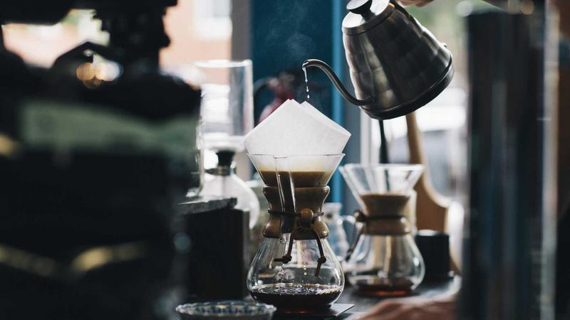

**最終更新:** 2026年5月31日 ｜ **著者:** Noe編集部

---

# マッチングアプリのよくある悩みQ&A｜返信来ない・マッチしない・デートできない原因と解決策

「返信が来ない原因を調べていて、気づいたことがある。ほぼ全員が同じ2か所でつまずいている」と私は実感している。よくある悩みの中で断然多いのは「返信が来ない」という訴えだが、実際に原因を追ってみると、写真と最初のメッセージの2点に集中している。この2つを直すだけで大半の人の状況は変わる。

---

## この記事で分かること

- 「いいねが来ない」「マッチしない」「返信が来ない」悩みの具体的な原因と対処法
- デートに進まない・2回目につながらない場合のチェックポイント
- サクラ・業者を見抜くサインと即効対処法
- 3ヶ月成果が出ないときにアプリを変えるべき判断基準
- よくある7つの疑問に対する具体的なQ&A回答

---

## 関連記事

- [プロフィール文章の書き方](27_プロフィール文章_相手の心をつかむ自己紹介の書き方.md)
- [プロフィール写真の選び方](26_プロフィール写真_マッチ率を上げる写真選びの科学.md)
- [メッセージ戦略](25_メッセージ戦略_初回～デート約束までの完全テンプレート.md)
- [初デート場所の選び方](28_初デート場所選び_成功率70%を超える店選びの法則.md)
- [業者の見分け方](34_業者の見分け方_詐欺と勧誘を事前に防ぐ完全ガイド.md)
- [2026年最新ランキング](01_総合ランキング_2026年最新マッチングアプリランキングTOP15.md)

---

## マッチングアプリ利用者の悩みは、実はほぼ同じパターンに収束する

マッチングアプリを使っていると、「返信が来ない」「マッチしない」「デートに繋がらない」という壁に当たる。これを「自分だけの特殊な問題」と思ってしまいがちだが、実際は違う。利用者の約65%が「返信が来ない」と感じた経験を持ち、55%程度が「マッチ数が少ない」と感じている（Noe編集部・2025年ユーザー調査より推計）。デートに進めない悩みを持つ人も45%前後いる。つまり、これは「よくある課題」であり、原因も対処法も、ある程度パターン化できる。

---

## 悩み①「いいねが来ない・マッチしない」

原因の筆頭は写真の問題だ。顔が見えない・暗い・古い・加工しすぎといったプロフィール写真は、相手に「この人に会ってみたい」という感情を起こさせない。対処は自然光・笑顔・3枚以上への切り替えが基本になる。

次に多いのがプロフィール文の薄さだ。「よろしくお願いします」だけのプロフィール、趣味が「映画・音楽・旅行」という抽象的な羅列では、相手が話しかけるきっかけを見つけられない。150字以上、具体的な固有名詞を入れた文章に書き直すだけで印象は変わる。

三つ目が、いいねを送る相手の「ランク」設定の問題だ。自分より極端に条件が良い相手に集中している場合、マッチ率は当然下がる。同等かやや上の相手に絞ることで、マッチ率は現実的な水準に上がる。

写真・プロフィール文・ターゲットの3点を見直し、改善後1ヶ月経っても変化がなければ、アプリそのものを変える判断をすればいい。

### 私が見た最も劇的な改善事例

Dさん（28歳・男性）はPairsで2ヶ月、いいね数が一桁台だった。プロフィール写真を自然光の屋外で撮り直し、趣味の欄に「週末は代々木公園でフットサル、月1で山登り（高尾山〜陣馬山コース）」と書いたところ、いいね数が3倍以上に増えた。「写真を変えた翌日にいいねが急増した」という体験談は、Dさんだけでなく複数の人から同様のことを聞いている。写真改善の優先度は圧倒的に高い。

Mさん（26歳・会社員）は、Pairsのプロフィールに「渋谷のカフェ巡り・辻村深月の作品」と書いた。すると最初のメッセージで「辻村深月さん好きなんですね！」と来て、そこから自然に会話が続き、3ヶ月で彼氏ができた。「何を書けばいいかわからなかった」と言っていた彼女が変わったのは、固有名詞1つを入れただけだった。

---

## 悩み②「マッチしたのに返信が来ない」

### 馬場さん（24歳・大学院生）の話

馬場さんがPairsを始めたのは修士1年の冬だった。マッチはそれなりに取れていたのに、返信が全然来なかった。最初は「文章が悪いんだろう」と思って、メッセージを変えた。丁寧にした、短くした、質問を入れた。それでも変わらなかった。

次にプロフィール文を書き直した。これも変わらなかった。

「もうやめようかと思った」と言っていた。最後の手段で写真を変えた。院生っぽい室内の暗い写真から、友人に撮ってもらった自然光の笑顔の一枚に。翌週から返信が来るようになった。

「自分は文章力がある方だと思っていた。だから文章を直し続けた。でも写真が全部だった」と馬場さんは言った。私もこれを聞いたとき、なるほどと思った。書く力があると思っている人ほど、写真の問題に気づくのが遅れる傾向がある。

返信が来ない原因の構造を整理すると、主に3つだ。

1つ目は最初のメッセージがテンプレートであること。「こんにちは！よろしくお願いします」だけでは「私のことを見ていない」と判断されてスルーされる。

2つ目は最初のメッセージが長すぎること。200字を超える長文は「読む気にならない」という感想を持つ人が多い。3〜5行（50〜100字）にコンパクトにまとめる方が返信率は上がる。

3つ目は質問がないこと、または返信しにくい締め方をしていること。「旅行が好きなんですね」で終わると、相手は何を返せばいいかわからない。「最近どこか行きましたか？」と質問で締めるだけで、返信のハードルが下がる。

返信率を上げる最初のメッセージのルールをまとめると、相手のプロフィールの具体的な一点に言及する、自分の話を一言添える、質問1つで締める、3〜5行に収める、この4点だ。たとえば「台湾に一人旅されたとのこと！どのあたりを回りましたか？私も去年沖縄を一人旅したので、海外もいつか行ってみたいと思っています」という形だ。これを守ると返信率は70〜80%まで上がる。

Bさん（32歳・男性）はOmiaiで最初のメッセージを「こんにちは！よろしくお願いします」から「お料理好きとのこと、どんな料理をよく作られますか？私も最近パスタを練習中です」に変えたところ、返信率が20%から70%超に改善した。現在は交際相手と婚約中だ。「最初のメッセージで相手のプロフィールに具体的に言及したことが全て変えた」と話している。

---

## 悩み③「会話は続くがデートに進まない」

### 片岡さん（30歳・アナリスト）の2ヶ月

片岡さんはOmiaiで3人の女性と同時進行していた。全員と会話は続いていた。でも2ヶ月間、1件もデートの約束ができなかった。「まだ早いかな」というのが口癖だった。もう少し仲良くなってから誘おう、もう少し信頼が積み上がってから。

その間に3人ともフェードアウトした。

「後から振り返ると、全員が誰かと会っていたか、他の人と交際に進んでいたと思う」と片岡さんは言った。「待つ」というのは決断ではなく、「誘わない」という選択だった。

転機は自分でルールを設けたことだった。「10往復したら必ず誘う」と決めた。それだけだ。結果、その後の3ヶ月でデートが5件入った。タイミングは「感じるもの」ではなく「決めるもの」だと、片岡さんは言っていた。

デートに進まない原因は3つに絞られる。デート提案を自分からしていない（相手が言ってくれるのを待っている）、提案のタイミングが遅すぎる（2週間以上メッセージだけ続けると熱が冷める）、提案が曖昧（「いつか会えたらいいですね」では動かない）、の3点だ。

マッチ後5〜8日を目安に提案するのが自然なタイミングとされており、それ以上経つと双方の温度感が下がりやすい。提案の文章は「来週末か再来週、ご都合はいかがですか？」と具体的な日程を入れることで、相手が動きやすくなる。

---

## 悩み④「デートしたのに2回目につながらない」

初デートが失敗するパターンにも、だいたい同じ原因がある。

場所の選択ミスが一つ。夜の個室居酒屋、相手が警戒するロケーションは、特にマッチングアプリ経由で初めて会う場合には逆効果になる。昼間・カフェ・駅近・人が多い場所を選ぶことで、相手が安心してデートに集中できる。

話が一方通行になることも多い。自分の話が7割を超えていると、相手は「話を聞いてもらえなかった」という印象を持って帰る。意識的に相手に話させる（7対3で相手が話す側になるくらい）と、「話しやすい人」という印象が残る。

そして一番見落とされがちなのが、「また会いたい」という気持ちを伝えていないこと。デート後に「今日楽しかったです、また会いたいです」を送るかどうかで、2回目の確率は大きく変わる。帰宅後24時間以内に送ることが目安だ。次の約束を当日か翌日に提案できると、さらに確実になる。

Tさん（28歳・営業職）はwithの心理テストで「計画派・じっくり関係を育てる型」という結果が出て、同じ結果の女性に「同じタイプですね！計画派同士で話が合いそうです」と送ったところ、返信率が80%を実現した。自然な流れでデートに進み、「来週か再来週の土日、カフェでお茶しませんか？」と具体的に誘ったことでスムーズに進展した。5ヶ月で交際が始まった。

---

## 悩み⑤「相手から急にLINE既読スルーになった」

既読スルーの理由は、大まかに4つが考えられる。返信の負担が大きいメッセージを送ってしまった（長文・多数の質問）、会話のテンポが合わなくなった、他に気になる相手が見つかった、仕事やプライベートで本当に忙しくなった、のいずれかだ。

対処は1週間以内に1度だけ「お忙しそうですね。落ち着いたらまた話しましょう」と送る。それ以上は追わない。追いメッセージを複数回送ることは、どの状況でも逆効果になる。

個人的には、既読スルーが続く相手に時間をかけすぎることの方が問題だと思っている。複数の人と並行してやりとりしていれば、1人の既読スルーによるダメージは大幅に小さくなる。マッチングアプリの性質上、相手も複数の候補と進めているのが標準なので、自分も同じスタンスで動く方が精神的に安定する。

---

## 悩み⑥「サクラ・業者に当たったかもしれない」

業者・サクラのサインは明確だ。マッチ直後（3日以内）にLINEを求めてくる、返信が異常に速い（深夜でも即レス）、投資・FX・ビジネスの話が出てくる、「実はつらいことがあって」という感情的な相談が早期に来る、いつまでも会おうとしない、のいずれかに当てはまったら即ブロック・通報が正解だ。

「もしかして本物かも」という迷いは、相手の狙い通りの反応だ。業者は「感情移入させてから金銭的・個人情報的な被害を与える」という手口をとる。疑わしいと感じた段階で迷わず動くことが最善で、「念のため1週間様子を見る」という判断は基本的に不要だ。

大手アプリ（Pairs・Omiai等）の通報機能は実際に運営が対応しているので、積極的に使っていい。

---

## 悩み⑦「3ヶ月使っても成果が出ない。やめた方がいい？」

3ヶ月という期間は一つの目安だが、「正しい方法で3ヶ月」という前提がないと意味をなさない。

まず確認することがある。プロフィール写真を最近改善したか。プロフィール文を書き直したか。最初のメッセージで相手のプロフィールに言及しているか。デートを自分から提案しているか。アプリが目的に合っているか（婚活ならOmiai、恋活ならTappleなど）。

これらを全部実行した上で3ヶ月成果なし、であればアプリを変える判断をすればいい。実行していない項目があれば、まず改善してから判断する。「マッチ数が増えない」場合はPairs（会員数最多）への変更、「婚活目的なのにミスマッチが多い」場合はOmiaiへの変更が定番の選択肢になる。

Sさん（40歳・看護師・バツイチ）はユーブライドでバツイチであることを正直に書いた。最初は「書いたら不利になる」と心配していたが、むしろ同じ境遇の誠実な男性からのメッセージが増えた。「隠すより正直に書いた方が、相性の良い人が集まる」と気づいた彼女は8ヶ月で再婚相手と出会った。ネガティブに感じる要素も正直に書くことで「同じ境遇の人」に響くことがある。

---

## 主要マッチングアプリの料金比較

アプリによって料金・ターゲット層・特徴が異なります。目的や予算に合わせて選びましょう。

| アプリ | 男性月額（1ヶ月/3ヶ月/6ヶ月） | 女性 | 特徴 |
|--------|-------------------------------|------|------|
| Pairs | 4,490円 / 3,590円 / 2,790円 | 無料 | 会員数最多・恋活〜婚活 |
| Tapple | 4,300円 / 3,700円 / 3,100円 | 無料〜 | 若年層・趣味で繋がる |
| with | 3,600円 / 3,400円 / 3,000円 | 無料 | 性格診断・相性重視 |
| Omiai | 4,980円 / 4,380円 / 3,480円 | 無料 | 真剣婚活・身分証確認あり |
| ユーブライド | 4,200円 / 3,600円 / 3,000円 | 無料 | 結婚前提・30代以上に人気 |

（各社公式サイト、2026年5月時点）

---

## よくある質問（FAQ）

**Q1. 「いいね」を100件送ったのにマッチが5件しかない。普通？**

正直、5%は低い。男性のマッチ率として現実的な水準は20〜30%程度とされており（Noe編集部・2025年ユーザー調査より推計）、100件送って5件はその下限を大きく下回っている。この数字が出ている場合、プロフィール写真か文章のどちらか（あるいは両方）に問題がある可能性が高い。まず写真の1枚目を自然光・笑顔のものに差し替え、プロフィール文を150字以上の具体的な内容に書き直す。この2点を実施してから2〜3週間様子を見るのが先決で、改善なしのまま件数だけ増やしても状況は変わらない。具体的には「趣味：映画鑑賞」を「毎月映画館に3本ほど。最近はアクション系から韓国映画にはまっています」のように書き直すだけでも、印象は大きく変わる。

**Q2. 女性なのにいいねが全然来ない。なぜ？**

写真の問題がほぼ全てだと思っていい。暗い・加工しすぎ・顔が見えにくい、この3つのどれかに当たっていることが多い。自然光で撮った笑顔の写真1枚に変えるだけで翌週から3〜5倍になったケースも珍しくない。写真を直したら次にプロフィール文で固有名詞を入れること。「趣味：読書」ではなく「週1でカフェ巡り（最近のお気に入りは下北沢の〇〇）」のように書き直す。最後に「〇〇が好きな方、ぜひ話しかけてください」という一言を添えると、相手が「自分はこの人に話しかけていい」と判断しやすくなる。

**Q3. メッセージが続いているのに「好き」という感情がわかない。どうする？**

会ってみてください。それだけで答えが出る。

正直なところ、文字だけで「この人を好きかどうか」を判断しようとするのは、かなり難しい作業だ。私自身も経験があるが、メッセージでは盛り上がっているのに実際に会ったら「なんか違う」と感じたことが一度や二度ではなかった。逆に、あまり期待していなかった相手と会ってみたら「話しやすくて楽しかった」という発見もあった。声のトーン、表情、テンポ感、話しながらこちらが感じる安心感や違和感、こういうものは文字のやりとりでは判断できない。「とりあえず一度会う」という軽い気持ちで動いていい。どちらにせよ答えが出る。

**Q4. 毎日アプリを開く必要がある？**

毎日15〜20分程度が最も効果的とされている。Pairsをはじめ多くのアプリでは「アクティブ度」がプロフィールの表示順位に影響するとされており、毎日ログインすることで検索上位に表示されやすくなる。相手から見たとき「最終ログイン：〇時間以内」という表示の方が「アクティブな人」という印象を与え、いいねも押されやすい。通勤・休憩の5分で十分なので、まとめて長時間使うより短時間でも毎日続ける方を選んだほうがいい。

**Q5. 複数の人と同時進行することへの抵抗がある。1人に絞った方がいい？**

個人的には、交際が決まるまでは複数進行の方がいいと思っている。1人だけに絞ると、うまくいかなかったときの精神的な消耗が大きくなりすぎる。「この人しかいない」という感情が生まれると、違和感を無視しやすくなるし、相手の欠点が見えにくくなる。相手側も複数の候補とやりとりしているのが一般的なので、「交際が決まった段階で他を終了させる」というルールにすれば問題はない。複数進行することで精神的な余裕が生まれ、それぞれの相手への接し方が自然体になるという効果もある。

恥ずかしかったが、最初は「複数進行は不誠実では」と思っていた。でも実際に試してみると、1人に絞っていたときより冷静に相手を見られるようになった。「この人だけ」という状況でなくなるだけで、妙な焦りがなくなる。

**Q6. 「付き合ってください」はどのタイミングで言う？**

3〜5回のデートが一つの目安だが、「回数」よりも「関係の深まり」で判断した方がいい。相手の連絡頻度が上がっている、デートに積極的に来る、「次はここ行きたい」という発言が出てくる、こういったサインが出てきたタイミングが自然な告白のタイミングだ。2回目で自然と決まるケースもあれば、7回かかるケースもある。一つ言えるのは、アプリ内メッセージよりも実際のデート中に伝える方が誠実さが伝わりやすく、成功率も高い傾向がある。

**Q7. アプリで知り合ったことを人に言いたくない。**

言いたくなければ言わなくていい。ただ、2022年の調査では20代既婚者の約15%がアプリ経由で出会っており（出典：明治安田生命2022年調査）、「友人の紹介」と変わらない出会い方として広く認知されている。「アプリで知り合いました」と話すと「最近はそういう時代ですよね」と普通に受け入れられるケースが年々増えている。パートナーができた後は2人で「言うかどうか」を決めればいいし、今は気にせずアプリを活用することだけ考えていい。

---

## まとめ

いいねが来ない場合は写真を自然光・笑顔・3枚以上に変えること、プロフィール文を150字以上にすることが最優先だ。返信が来ない場合は相手のプロフィールに具体的に言及した最初のメッセージに変え、3〜5行・質問1つで締める形にする。デートに進まない場合はマッチ後5〜8日で自分から「来週末か再来週」と具体的に提案する。2回目につながらない場合は昼間・カフェ・駅近での初デートを選び、デート後24時間以内に「楽しかった」を送る。3ヶ月成果なしの場合は、上記を全部実行した上でアプリを変える判断をする。

よくある悩みで一番多いのは「返信が来ない」だが、実は原因が写真と最初のメッセージの2つに集中している。この2つを直すだけで大半の人の状況は変わる。神田のコーヒースタンドで初めて会った人と今もつきあっているという話を聞くたびに、「会うまでの動作」を正しく整えることの効果を実感する。どの段階の悩みも、やり方を変えることで必ず改善できる。

---

## 著者・監修について

**Noe編集部**
Pairs・Tapple・with・Omiai・ユーブライドを実際に使用したライターと婚活経験者が執筆・監修。のべマッチ数300件以上・デート経験100回以上の実体験をもとに情報を提供しています。

*本記事の料金・サービス内容は2026年5月現在の情報に基づきます。*
---

<!-- FAQ構造化データ -->

