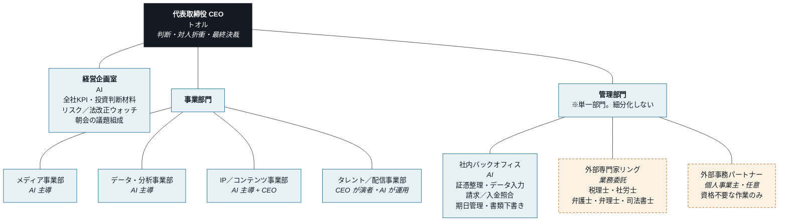

# ノイハウス 組織設計書（v0.1 / 2026-07-30）

> **このファイルの置き場所について**
> ディレクトリ名を `_corporate/` としているのは、Jekyll がアンダースコア始まりの
> ディレクトリを出力対象から除外するため。このリポジトリは GitHub Pages で
> noe-match.com として公開されており、かつ **リポジトリ自体が public** である。
> したがって：
> - このファイルは「そのまま公開されても困らない内容」に限定して書く
> - どの事業を法人名義／個人名義にするかの**実配置表は本ファイルに書かない**
>   （非公開管理＝Notion 側で管理する）
> - 将来的にはコーポレート用の**別プライベートリポジトリ（例：noe-hq）へ移設**する

---

## 0. 前提と未確定事項

| 項目 | 現状 | 対応 |
|------|------|------|
| 商号（日本語） | ノイハウス | 要確定 |
| 商号（英字） | 未確定（NOE HAUS / Neuhaus / NOI HAUS 等） | **登記前に確定**。ドメイン・商標と同時に押さえる |
| 法人形態 | 未定（株式会社 / 合同会社） | 下記 §5 参照 |
| 登記 | 未了 | §5 のロードマップ |
| 代表 | トオル（CEO・唯一の人間） | — |
| 人員構成 | 人間1名 + AIエージェント + 外部専門家 | — |

**設計思想**：CEO の職務は「判断」と「リアルでの対人コミュニケーション」の2つに限定する。
作業は原則すべて AI に寄せ、資格が必要な領域は外部専門家に直接委託する。
組織図はこの原則を構造として表現したものである。

---

## 1. 組織図



**凡例**

| 表記 | 意味 |
|------|------|
| 濃色（塗り） | 人間（トオル）が担う。判断・対人・最終責任 |
| 青（実線） | 社内 AI エージェントが担う。作業・調査・下書き・監視 |
| 橙（破線） | 法人の外。委託契約で動く。破線は「指揮命令しない」ことの表現 |

破線は意匠ではなく契約形態の表現である。外部委託先に時間拘束や指揮命令を行うと
偽装請負として実質雇用と判断されるリスクがあるため、図の段階で線種を分けている。

---

## 2. 部門定義

| 部門 | 目的 | 主な担い手 | CEO の関与 |
|------|------|-----------|-----------|
| 経営企画室 | 全社の数字を1枚にし、機会とリスクを先出しする | AI | 毎朝の判断のみ |
| メディア事業部 | 記事資産による集客と収益化 | AI（記事工場が稼働中） | 方針判断・法令グレーの裁定 |
| データ・分析事業部 | データ収集→分析→レポートの反復 | AI | 出力の採否判断 |
| IP／コンテンツ事業部 | 独自理論・手法・スキルの権利化とライセンス | AI + CEO | 中核概念の設計は CEO |
| タレント／配信事業部 | CEO 自身の実演を軸とした配信・タレント事業 | CEO（演者）+ AI（運用） | 出演そのもの |
| 管理部門 | 会社を法的・会計的に成立させ続ける | AI + 外部専門家 | 押印・意思決定・支払承認 |

管理部門をあえて「経理財務／法務／人事」に分けないのは、担当者が実在しない段階で
部門を割ると、責任者不在の空箱が増えるだけで実務が回らないため。
分割は**外部専門家が2人以上同じ領域に並んだ時点**で検討すればよい。

---

## 3. 「管理部門を外注する」の設計

### 3.1 結論：まるごと外注はできない

管理部門の業務には**士業の独占業務が含まれる**ため、「管理部門を個人事業主1名に丸投げ」は
法律上成立しない。委託先が無資格であれば、委託した側も違法状態に加担することになる。

| 業務 | 無資格の個人事業主に出せるか | 根拠・注意点 |
|------|------------------------|-------------|
| 領収書・請求書の整理、会計ソフトへの仕訳入力 | ○ 出せる | 税務判断を伴わない単純作業に限る |
| 勘定科目の判断、決算書・申告書の作成、税務相談 | ✕ **税理士のみ** | 税理士法。名義を借りる形も不可 |
| 労働・社会保険の届出書類の作成・提出代行 | ✕ **社労士のみ** | 社労士法27条。罰則あり（1年以下の拘禁刑または100万円以下の罰金） |
| 就業規則・賃金台帳・労働者名簿の作成 | ✕ **社労士のみ** | 同27条（2号業務） |
| 紛争性のある交渉、法律判断を伴う契約対応 | ✕ **弁護士のみ** | 弁護士法72条 |
| 設立・変更の商業登記申請の代理 | ✕ **司法書士のみ** | 司法書士法73条 |
| 特許・商標の出願代理 | ✕ **弁理士のみ** | 弁理士法75条 |
| 請求書発行、入金照合、経費立替精算、期日リマインド、資料の下書き整形 | ○ 出せる | 資格不要 |

### 3.2 したがって採る構造：1部門 ＋ 士業リング ＋ 作業委託

```
管理部門（1部門）
 ├─ 社内 AI ……… 資格不要な作業と期日管理、士業への論点整理
 ├─ 士業リング … 領域ごとに専門家と「直接」契約（再委託・名義貸しは不可）
 └─ 事務委託 …… 資格不要な作業のみ、量が増えたら個人事業主へ
```

士業とは必ず**法人が直接契約する**。「事務委託先の個人事業主が税理士を手配する」形は
名義貸しに近づくため採らない。

### 3.3 個人事業主に委託する場合の法的留意点

- **取引条件の明示義務**：業務委託時、給付内容・報酬額・支払期日等を書面または
  電磁的方法で明示する義務がある（フリーランス新法）。従業員のいない一人会社は
  「特定業務委託事業者」には当たらず広範な義務までは負わないが、**明示義務は負う**。
- **従業員を1人雇った瞬間に義務が増える**：週20時間以上かつ31日以上の雇用見込みの
  従業員を使用すると「特定業務委託事業者」となり、60日以内の報酬支払、中途解除の
  30日前予告など義務が発生する。**採用を検討する時点で契約書を作り直す前提で設計する。**
- **偽装請負を避ける**：勤務時間の指定、常時オンライン待機の要求、業務手順の細かい
  指揮命令は行わない。成果物と納期で管理する。
- **秘密保持と権限**：会計・メール・Notion への権限を渡す場合、最小権限とし、
  アクセスログを残す。IP 事業を持つ以上、成果物の権利帰属を契約に明記する。

---

## 4. 公開事業と非公開事業の切り分け（方法論）

**実際にどの事業をどちらに置くかは本ファイルには記載しない**（公開リポジトリのため）。
ここでは判断基準のみを定義する。

### 4.1 3層モデル

| 層 | 定義 | 対外的な扱い |
|----|------|-------------|
| L1 公開 | 法人名義。HP に社名・事業として掲載し、取引先・士業・金融機関に開示する | 公開 |
| L2 法人内・非掲載 | 法人名義だが HP には載せない（検証中・規制が未整理・ブランド不整合） | 開示請求時のみ |
| L3 法人外 | 個人名義で行い、法人とは会計・契約・資産を完全に分離する | 非公開 |

### 4.2 L3 に置く判断基準（いずれかに該当するもの）

1. 法人ブランドと目的が衝突する
2. 業法上の許認可・規制の整理が済んでいない
3. 収益が不安定で、法人の決算に載せると与信評価を歪める
4. CEO 個人の属性と不可分で、法人資産として切り出せない

### 4.3 分離を「実際に」成立させるための要件

名義を分けるだけでは分離にならない。以下が揃って初めて分離が成立する。

- **契約主体**：契約書・利用規約の当事者名義
- **請求と入金**：請求書の発行名義と入金口座
- **使用資産**：ドメイン、機材、サブスク、アカウントの帰属
- **費用負担**：経費をどちらで落としているか
- **リスク負担**：損失が出たとき誰が負うか

同一人物が法人と個人事業を並走させ、利益や費用を都合よく振り分けると、
**実質は法人の事業と認定されて否認されるリスク**がある。基準を先に文書化し、
毎期その基準どおりに処理していることを示せる状態を作る。

### 4.4 非公開側が露出する経路（潜在リスク）

分離設計とは別に、以下の経路で紐づけが起きる。設計時に潰しておく。

- ドメインの Whois・登録メールアドレス
- 決済／振込名義、ASP・プラットフォームの登録情報
- 同一の SNS アカウント、同一の顔・声・文体
- 同一の GitHub アカウント・公開リポジトリ
- HP の運営者情報・プライバシーポリシーの記載

---

## 5. 法人設立ロードマップ

### Step 1：登記の前にやること

| # | やること | なぜ先か |
|---|---------|---------|
| 1 | 商号（日英）の確定 | 以降すべての前提。後から変えると登記・口座・契約を全部やり直す |
| 2 | **商標の先行調査**（J-PlatPat）と出願方針 | IP 事業をやるなら商号より商標が資産。登記は商標権を与えない。他社の先行商標があれば商号自体を変える必要がある |
| 3 | 本店所在地の決定 | 自宅／実オフィス／バーチャルオフィス。将来 職業紹介などの許認可を取るなら実体のある事務所が要件になり得る |
| 4 | 法人形態の決定 | 株式会社＝信用・将来の出資受入に有利／合同会社＝設立費用が安く機関設計が簡素。IP ライセンスと取引先審査を重視するなら株式会社 |
| 5 | 定款の事業目的の設計 | 後の事業（IP ライセンス、タレントマネジメント、広告、ソフトウェア開発、将来の有料職業紹介など）を**先に入れておく**。追加は変更登記が必要で費用がかかる |
| 6 | 資本金の決定 | 1,000万円未満なら消費税の免税制度が使える。ただし §5 補記のインボイス論点と必ずセットで判断する |
| 7 | 決算期の決定 | 繁忙期と決算作業が重ならない月を期末にする。設立月から最長 12 か月取れるよう選ぶ |

### Step 2：登記

司法書士に依頼するか自分で申請する。定款認証（株式会社の場合）→ 登記申請。

### Step 3：登記直後の期限つきタスク（ここが一番落としやすい）

| 期限 | 手続 | 落とすとどうなるか |
|------|------|-----------------|
| 設立から**3か月以内** | 役員報酬の額を決議し、以後**定期同額給与**として支払う | 期中に金額を動かすと損金不算入。初年度の税額が跳ねる |
| 設立から3か月を経過した日と最初の事業年度終了日のうち**早い日の前日まで** | 青色申告の承認申請 | 欠損金の繰越（初年度赤字の繰越）が使えない |
| 速やかに | 法人設立届出書（税務署・都道府県・市町村） | — |
| 速やかに | 給与支払事務所等の開設届、源泉所得税の納期の特例申請 | 特例なしだと毎月納付になり事務が増える |
| 速やかに | 社会保険（健康保険・厚生年金）の新規適用 | **役員報酬を出す一人法人でも原則加入義務**。役員報酬ゼロなら加入できない＝国民健康保険のまま |
| 順次 | 法人口座の開設、既存 ASP・プラットフォームの契約名義変更 | 名義変更は**審査が入り時間がかかる**。売上入金が止まらないよう順序を設計する |

### 補記：消費税とインボイスの二択

資本金 1,000万円未満なら設立1〜2期は原則として消費税の免税事業者になれる。
一方で**インボイス発行事業者に登録すると免税は使えなくなる**。
広告・アフィリエイト報酬の支払元が仕入税額控除のためにインボイスを求めるかどうかで
損得が逆転するため、**主要な支払元にインボイスの要否を確認してから決める**。
これは登記より後でも判断できるが、放置すると1期目の利益が変わる。

### 補記：既存事業を法人に移すかどうか

すでに個人名義で稼働・収益化している資産（ドメイン、記事、アカウント、契約）を
法人に移す場合、**適正な価格での事業譲渡**として扱う必要がある。無償・低廉な移転は
税務上問題になる。「移す／移さない」は事業ごとに §4 の基準で判断し、移す場合は
評価方法を税理士と決めてから実行する。

---

## 6. 事業ごとの業法チェック（着手前に確認する項目）

| 事業 | 主に見るべき法令・論点 | 現状 |
|------|-------------------|------|
| メディア（アフィリエイト） | 景品表示法（ステマ規制・PR 表記・優良誤認）、薬機法（美容・健康の表現） | 運用ルールを AGENT.md に規定済み |
| データ・投資分析 | 金融商品取引法（投資助言・代理業の登録要否）。特定銘柄の売買推奨を対外提供すると登録が必要になり得る | **要確認。公開範囲の判断が必要** |
| IP／コンテンツ | 著作権法（AI 生成物の権利帰属、既存著作物との類似）、特許法・商標法。職務著作と外注成果物の権利帰属を契約で明記 | **要整備** |
| タレント／配信 | 職業安定法（他人を所属させ紹介料を得る形なら有料職業紹介の許可）、労働者性の判断、未成年者の保護、プラットフォーム規約 | §7 参照 |
| 実演（催眠等） | 医師法17条（医業）との線引き。治療・効能を謳わない。参加者の事前スクリーニングと同意取得、賠償責任保険 | **要整備** |

---

## 7. タレント／配信事業の段階設計

段階を分けると、必要な許認可のタイミングが変わる。

| 段階 | 内容 | 許認可 |
|------|------|-------|
| Phase 1 | **CEO 自身のみが出演**。法人がプラットフォームと契約し、配信収益を法人で受ける | 職業紹介にあたらない。特別な許可は不要 |
| Phase 2 | 他の配信者と**マネジメント契約**を結び、収益をレベニューシェアする | 契約の実質次第。労働者性の判断、報酬支払義務、フリーランス新法の適用を確認 |
| Phase 3 | 配信者を**プラットフォームに紹介して紹介料を得る** | **有料職業紹介事業の許可（職業安定法）が論点になる**。財産要件（基準資産額・現金預金）と事務所要件があるため、実オフィスと資金の準備が前提。着手前に管轄の労働局へ事前照会する |

Phase 1 なら今すぐ始められる。Phase 2 以降は契約書の設計が事業の中身そのものになる。
「小さく事務所を作る」場合も、**他人を1人所属させた瞬間に論点が発生する**ことを前提に、
Phase 1 と Phase 2 の境目を意識的に管理する。

---

## 8. 日次オペレーション（朝会）

CEO の稼働は 8:00–10:00。この2時間で「その日以降、CEO が不在でも回る状態」を作る。

| 時刻 | 枠 | 内容 | 誰が |
|------|----|------|------|
| 7:00 | — | **AI が前夜までの結果を収集し、ブリーフを生成しておく** | AI（自動） |
| 8:00–8:15 | ヘルスチェック | 前夜の定期実行の成否、エラー一覧、要人手の切り分け | AI が提示 → CEO が対処判断 |
| 8:15–8:40 | 課題トリアージ | 各セッションが上げた課題候補を「これは課題か／課題でないか」で仕分け。課題なら期限を切る | **CEO の判断** |
| 8:40–9:10 | 事業レビュー | 各事業部の数値と前日差分。異常値のみ深掘り | AI が提示 |
| 9:10–9:45 | 提言 | 機会（横展開・統合の余地）、リスク（法改正・規約変更・アカウント停止兆候）を根拠つきで提案 | AI が提案 → **CEO が採否決定** |
| 9:45–10:00 | 確定とログ | 当日の決定事項を記録し、日中の自走設定を反映 | AI |

**7時か8時かの答え**：ブリーフの生成には時間がかかるため、**AI 側は 7:00 に起動、
人間は 8:00 から読む**のが正解。8:00 に起動させると読み始めが 8:30 以降になる。

### 提言に求める質

「AI の会社であっても、やることは通常の事業会社と同じ」という前提を守る。
提言は次の型を満たすものだけを上げる。

- **横展開**：ある事業部で成立した施策を他事業部に適用できないか
- **統合**：事業部をまたいで重複している管理・作業を1本化できないか
- **リスクの先出し**：法改正、プラットフォーム規約変更、アカウント停止の兆候
- **効率化**：CEO の判断待ちで止まっている工程の特定と、判断基準の事前定義

抽象論は上げない。数値・固有名詞・想定コスト・想定期間を必ず添える。

---

## 9. AI 運用のガバナンス

CEO が「判断」に専念するには、**AI がどこまで独断で実行してよいか**を先に決める必要がある。

| 区分 | 例 | 権限 |
|------|----|------|
| 自動実行してよい | 調査、下書き生成、内部データ更新、レポート作成、テスト | AI 単独 |
| 事前定義された基準内なら自動 | 記事公開（法令ルール準拠が機械判定できる範囲）、定型返信の下書き | AI 単独＋事後確認 |
| **必ず人間の承認が必要** | 対外的な発信（SNS 投稿・公開ページ）、送金・支払、契約締結、第三者への個人情報提供、料金・価格の変更 | CEO 承認 |

「外に出る行為」と「金が動く行為」は人間の承認を必須にする。ここを曖昧にすると、
自動化の効率よりも事故の損失が大きくなる。

### スキル・エージェントの保守

- スキルは資産である。**改訂履歴と、なぜその指示を入れたかの理由**を残す
- 定期実行に失敗が続いたスキルは、朝会のヘルスチェックで必ず可視化する
- 同じ指示が複数のスキルに重複し始めたら共通化する（現在すでに週次の指示文が
  2つの定期実行にほぼ同内容で存在している）

---

## 10. 事業継続（一人法人の最大リスク）

人間が1名しかいない構造の最大の弱点は、その1名が停止したとき全事業が止まることである。
組織図に人を増やせない以上、**引き継ぎ可能性を仕組みで担保する**。

- 認証情報（各種 ID／パスワード／API キー／2段階認証のリカバリコード）の保管場所と、
  緊急時にアクセスできる人を決めておく
- ドメイン・アカウントの契約更新が自動更新になっているか、支払カードの有効期限
- 主要な自動化が「誰の PC にも依存していない」状態にする（§11）
- 士業との契約に、緊急時の連絡先を含める

---

## 11. 自動化の実行場所

自動化が「自分の PC が動いていなくても回るか」は、事業継続と直結する論点である。
現状を実機で確認した結果は以下。

| 自動化 | 実行場所 | PC 依存 |
|--------|---------|--------|
| 週次の記事生成（月曜便・木曜便） | クラウド実行環境 | **不要** |
| 日次のデータ分析レポート | クラウド実行環境 | **不要** |
| GSC データ取得（`.github/workflows/fetch-gsc.yml`） | GitHub Actions | **不要** |
| 外部サービス連携（メール・カレンダー・ドキュメント等） | リモート接続（HTTPS） | **不要**。PC 側のアプリは不要 |
| `scripts/weekly_gsc_push.bat` | **Windows タスクスケジューラ**（`C:\Users\tatsu\noe-match-local`） | **必要** |

**現状 PC 依存が残っているのは `weekly_gsc_push.bat` の1件のみ。**
しかもこれは GitHub Actions の GSC 取得と**同じ処理の二重化**になっている
（Actions が日曜 22:00 JST、`.bat` が日曜 23:00 JST）。
Actions 側が正常稼働しているなら `.bat` は廃止でよく、廃止すれば PC 依存はゼロになる。

**注意点**：クラウドで定期実行する場合、
- 外部サービス連携は定期実行の設定に**接続先を明示的に紐づけておく**必要がある
- 定期実行に許可するツールを絞りすぎると、スキルや Web 検索が使えず期待した動作にならない
  （現在稼働中の週次実行はファイル操作系のみ許可の設定になっている）
- デスクトップアプリ側で登録したスケジュールは**クラウドの一覧に出てこない＝ローカル保存**。
  PC 非依存にするならクラウド側の定期実行として登録し直す

---

## 12. 未整理の論点（優先度つき）

### 高（登記前後に決めないと後戻りが高くつく）

1. 商号の英字表記と**商標の先行調査**（IP 事業の中核資産。登記は商標権を与えない）
2. 既存の稼働資産を法人に移すか否か、移す場合の**譲渡価格の算定方法**
3. 資本金・決算期・**インボイス登録の要否**（主要支払元への確認が前提）
4. 役員報酬の額と社会保険加入（設立3か月の期限つき）
5. 定款の事業目的に将来事業を含めるか（後追いは変更登記コスト）

### 中（事業を進める前に整える）

6. AI の決裁権限規程（§9）の明文化
7. AI 生成物の著作権・権利帰属の社内規程と、外注契約への権利条項
8. 事業ごとの業法確認（特にデータ・分析事業の金商法、実演の医師法）
9. 個人情報保護法対応と、プライバシーポリシーの法人名義への更新
10. 電子帳簿保存法の要件を**最初から満たす形**で証憑保存フローを作る
11. 賠償責任保険の付保（実演事業と受託業務）

### 低〜継続

12. 事業継続計画（§10）と認証情報の継承設計
13. 情報セキュリティ：外部サービス連携が常時接続される構成のため、権限最小化と監査
14. 非公開側の露出経路の点検（§4.4）を定期タスク化

---

*最終更新：2026-07-30*
